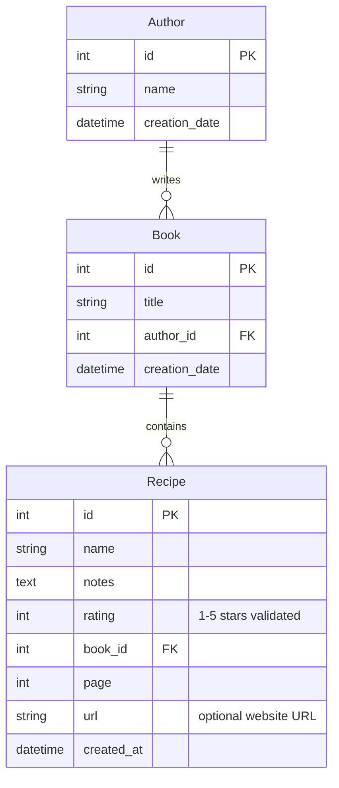

# API Reference

This document provides detailed information about the data models, services, and API patterns used in Mes Recettes.

## 📋 Table of Contents

- [Data Models](#data-models)
- [Validation Rules](#validation-rules)
- [Services](#services)
- [Supabase Integration](#supabase-integration)
- [API Patterns](#api-patterns)
- [Error Handling](#error-handling)
- [Service Reuse & Patterns](#service-reuse--patterns)

## 🏗️ Data Models

### Recipe Model

```csharp
[Table("recettes")]
public class Recipe : BaseModel
{
    [PrimaryKey("id")]
    public int Id { get; set; }
    
    [Column("name")]
    [Required(ErrorMessage = "Recipe name is required")]
    [MaxLength(255, ErrorMessage = "Recipe name cannot exceed 255 characters")]
    public string Name { get; set; } = string.Empty;
    
    [Column("notes")]
    public string? Notes { get; set; }
    
    [Column("rating")]
    [Range(1, 5, ErrorMessage = "Rating must be between 1 and 5")]
    public int Rating { get; set; } = 0;
    
    [Column("book_id")]
    public int? BookId { get; set; }
    
    [Column("page")]
    [Range(1, int.MaxValue, ErrorMessage = "Page number must be positive")]
    public int? BookPage { get; set; }
    
    [Column("url")]
    [Url(ErrorMessage = "Please enter a valid URL")]
    public string? Url { get; set; }

    [Column("created_at")]
    public DateTime CreationDate { get; set; } = DateTime.UtcNow;
    
    // Navigation properties (not stored in DB)
    public Book? Book { get; set; }
    public Store? Store { get; set; }
}
```

**Validation Rules:**
- `Name`: Required, max 255 characters
- `Rating`: **REQUIRED**, range 1-5 stars with enforced validation
- `Notes`: Optional, unlimited text
- `PageNumber`: Optional, must be positive when provided
- `Url`: Must be a valid URL format if provided

### Book Model

```csharp
[Table("books")]
public class Book : BaseModel
{
    [PrimaryKey("id")]
    public int Id { get; set; }
    
    [Column("title")]
    public string Title { get; set; } = string.Empty;
    
    [Column("author_id")]
    public int? AuthorId { get; set; }
    
    [Column("creation_date")]
    public DateTime CreationDate { get; set; } = DateTime.UtcNow;
    
    // Navigation properties
    public Author? Author { get; set; }
    public List<Recipe> Recipes { get; set; } = new();
}
```

**Validation Rules:**
- `Title`: Required, max 255 characters
- `AuthorId`: Optional foreign key to Authors table

### Author Model

```csharp
[Table("authors")]
public class Author : BaseModel
{
    [PrimaryKey("id")]
    public int Id { get; set; }
    
    [Column("name")]
    public string Name { get; set; } = string.Empty;
    
    [Column("creation_date")]
    public DateTime CreationDate { get; set; } = DateTime.UtcNow;
    
    // Navigation properties
    public List<Book> Books { get; set; } = new();
}
```

**Validation Rules:**
- `Name`: Required, max 255 characters

### Entity Relationships



## ✅ Validation Rules

### Data Validation Overview

The application uses comprehensive validation through System.ComponentModel.DataAnnotations and custom business rules.

#### Recipe Validation

| Property | Validation Rule | Error Message |
|----------|----------------|---------------|
| `Name` | Required, MaxLength(255) | "Recipe name is required" / "Recipe name cannot exceed 255 characters" |
| `Rating` | Range(1, 5) | "Rating must be between 1 and 5" |
| `PageNumber` | Range(1, int.MaxValue) | "Page number must be positive" |
| `Url` | Url format | "Please enter a valid URL" |

#### Author Validation

| Property | Validation Rule | Error Message |
|----------|----------------|---------------|
| `Name` | Required, MaxLength(255) | "Author name is required" / "Author name cannot exceed 255 characters" |

#### Book Validation

| Property | Validation Rule | Error Message |
|----------|----------------|---------------|
| `Title` | Required, MaxLength(255) | "Book title is required" / "Book title cannot exceed 255 characters" |
| `AuthorId` | Required | "Author is required" |

### Validation Testing

Our comprehensive test suite includes **524 tests** covering all validation scenarios, services, components, and integration testing:

```csharp
// Example: Rating validation test
[Theory]
[InlineData(1, true)]   // Valid: minimum
[InlineData(3, true)]   // Valid: middle  
[InlineData(5, true)]   // Valid: maximum
[InlineData(0, false)]  // Invalid: below range
[InlineData(6, false)]  // Invalid: above range
[InlineData(-1, false)] // Invalid: negative
public void Rating_ShouldValidateRange_ForAllValues(int rating, bool isValid)
{
    // Validation testing implementation
}
```

## 🛠️ Services

The service layer follows a query/service pattern and now relies on shared helpers to reduce duplication and standardize behavior:

- `CrudServiceBase<TModel, TService>` centralizes common CRUD flows with consistent logging and error mapping
- `ValidationGuards` provides reusable validation helpers used by all services
- `CacheServiceExtensions` adds `GetOrEmptyAsync` for resilient list caching and `RemoveMany` for cache invalidation

Currently, `AuthorService`, `BookService`, and `StoreService` derive from the CRUD base and use these helpers; `RecipeService` uses caching helpers for related cache invalidation.

### Recipe Service (excerpt)

```csharp
public interface IRecipeService
{
    Task<Result<(IReadOnlyList<Recipe> Items, int Total)>> SearchAsync(...);
    Task<Result<Recipe>> GetByIdAsync(int id, CancellationToken ct = default);
    Task<Result<Recipe>> CreateAsync(Recipe recipe, CancellationToken ct = default);
    Task<Result<Recipe>> UpdateAsync(Recipe recipe, CancellationToken ct = default);
    Task<Result<bool>> DeleteAsync(int id, CancellationToken ct = default);
    Task<IReadOnlyList<Book>> GetBooksAsync(CancellationToken ct = default);
    Task<IReadOnlyList<Author>> GetAuthorsAsync(CancellationToken ct = default);
}
```

### Author, Book, Store Services

These services implement their respective interfaces and derive from the CRUD base to:
- Validate inputs using `ValidationGuards`
- Use Supabase for data persistence
- Invalidate relevant caches on mutations
- Keep domain-specific logic (e.g., book-author associations)

## 🔌 Supabase Integration

### Configuration

```csharp
public class SupabaseConfig
{
    public string Url { get; set; } = string.Empty;
    public string Key { get; set; } = string.Empty;
}

// In Program.cs
var supabaseConfig = builder.Configuration.GetSection("Supabase").Get<SupabaseConfig>();
builder.Services.AddScoped(_ => new SupabaseClient(supabaseConfig.Url, supabaseConfig.Key));
```

### Query Patterns

```csharp
// Get all records
var recipes = await supabaseClient.From<Recipe>().Get();

// Get by ID
var recipe = await supabaseClient.From<Recipe>().Where(x => x.Id == id).Single();

// Update
var updated = await supabaseClient.From<Recipe>().Update(recipe);

// Delete
await supabaseClient.From<Recipe>().Where(x => x.Id == id).Delete();
```

## 📝 API Patterns

The application uses a `Result<T>` pattern for service results, combined with structured logging and consistent error messages.

## ⚠️ Error Handling

Common exception handling patterns are centralized via the base class helpers where possible. Network errors surface a standard message; unexpected errors map to a user-friendly message with logged details.

---

For more information, see:
- [Main Documentation](README.md)
- [Development Guide](DEVELOPMENT.md)
- [Architecture Guide](ARCHITECTURE.md)
