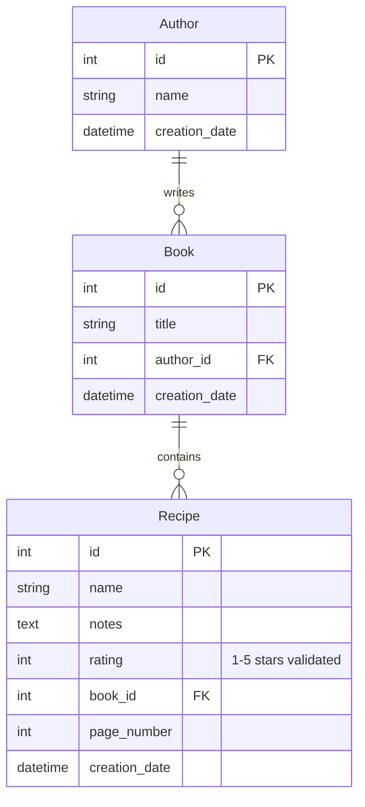

# API Reference

This document provides detailed information about the data models, services, and API patterns used in Mes Recettes.

## 📋 Table of Contents

- [Data Models](#data-models)
- [Validation Rules](#validation-rules)
- [Services](#services)
- [Supabase Integration](#supabase-integration)
- [API Patterns](#api-patterns)
- [Error Handling](#error-handling)

## 🏗️ Data Models

### Recipe Model

```csharp
[Table("recettes")]
public class Recipe : BaseModel
{
    [PrimaryKey("id")]
    public int Id { get; set; }
    
    [Column("name")]
    [Required(ErrorMessage = "Recipe name is required")]
    [MaxLength(255, ErrorMessage = "Recipe name cannot exceed 255 characters")]
    public string Name { get; set; } = string.Empty;
    
    [Column("notes")]
    public string? Notes { get; set; }
    
    [Column("rating")]
    [Range(1, 5, ErrorMessage = "Rating must be between 1 and 5")]
    public int Rating { get; set; } = 0;
    
    [Column("book_id")]
    public int? BookId { get; set; }
    
    [Column("page_number")]
    [Range(1, int.MaxValue, ErrorMessage = "Page number must be positive")]
    public int? PageNumber { get; set; }
    
    [Column("creation_date")]
    public DateTime CreationDate { get; set; } = DateTime.UtcNow;
    
    // Navigation properties (not stored in DB)
    public Book? Book { get; set; }
}
```

**Validation Rules:**
- `Name`: Required, max 255 characters
- `Rating`: **REQUIRED**, range 1-5 stars with enforced validation
- `Notes`: Optional, unlimited text
- `PageNumber`: Optional, must be positive when provided
- `PageNumber`: Optional, positive integer

### Book Model

```csharp
[Table("books")]
public class Book : BaseModel
{
    [PrimaryKey("id")]
    public int Id { get; set; }
    
    [Column("title")]
    public string Title { get; set; } = string.Empty;
    
    [Column("author_id")]
    public int? AuthorId { get; set; }
    
    [Column("creation_date")]
    public DateTime CreationDate { get; set; } = DateTime.UtcNow;
    
    // Navigation properties
    public Author? Author { get; set; }
    public List<Recipe> Recipes { get; set; } = new();
}
```

**Validation Rules:**
- `Title`: Required, max 255 characters
- `AuthorId`: Optional foreign key to Authors table

### Author Model

```csharp
[Table("authors")]
public class Author : BaseModel
{
    [PrimaryKey("id")]
    public int Id { get; set; }
    
    [Column("name")]
    public string Name { get; set; } = string.Empty;
    
    [Column("creation_date")]
    public DateTime CreationDate { get; set; } = DateTime.UtcNow;
    
    // Navigation properties
    public List<Book> Books { get; set; } = new();
}
```

**Validation Rules:**
- `Name`: Required, max 255 characters

### Entity Relationships



## ✅ Validation Rules

### Data Validation Overview

The application uses comprehensive validation through System.ComponentModel.DataAnnotations and custom business rules.

#### Recipe Validation

| Property | Validation Rule | Error Message |
|----------|----------------|---------------|
| `Name` | Required, MaxLength(255) | "Recipe name is required" / "Recipe name cannot exceed 255 characters" |
| `Rating` | Range(1, 5) | "Rating must be between 1 and 5" |
| `PageNumber` | Range(1, int.MaxValue) | "Page number must be positive" |

#### Author Validation

| Property | Validation Rule | Error Message |
|----------|----------------|---------------|
| `Name` | Required, MaxLength(255) | "Author name is required" / "Author name cannot exceed 255 characters" |

#### Book Validation

| Property | Validation Rule | Error Message |
|----------|----------------|---------------|
| `Title` | Required, MaxLength(255) | "Book title is required" / "Book title cannot exceed 255 characters" |
| `AuthorId` | Required | "Author is required" |

### Validation Testing

Our comprehensive test suite includes 109+ tests covering all validation scenarios:

```csharp
// Example: Rating validation test
[Theory]
[InlineData(1, true)]   // Valid: minimum
[InlineData(3, true)]   // Valid: middle  
[InlineData(5, true)]   // Valid: maximum
[InlineData(0, false)]  // Invalid: below range
[InlineData(6, false)]  // Invalid: above range
[InlineData(-1, false)] // Invalid: negative
public void Rating_ShouldValidateRange_ForAllValues(int rating, bool isValid)
{
    // Validation testing implementation
}
```

## 🛠️ Services

### Recipe Service

```csharp
public interface IRecipeService
{
    Task<List<Recipe>> GetAllRecipesAsync();
    Task<Recipe?> GetRecipeByIdAsync(int id);
    Task<List<Recipe>> GetRecipesByBookAsync(int bookId);
    Task<List<Recipe>> GetRecipesByRatingAsync(int rating);
    Task<List<Recipe>> SearchRecipesAsync(string searchTerm);
    Task<Recipe> CreateRecipeAsync(Recipe recipe);
    Task<Recipe> UpdateRecipeAsync(Recipe recipe);
    Task<bool> DeleteRecipeAsync(int id);
}

public class RecipeService : IRecipeService
{
    private readonly SupabaseClient _supabaseClient;
    
    public async Task<List<Recipe>> GetAllRecipesAsync()
    {
        try
        {
            var response = await _supabaseClient
                .From<Recipe>()
                .Order(x => x.CreationDate, Ordering.Descending)
                .Get();
            return response.Models ?? new List<Recipe>();
        }
        catch (Exception ex)
        {
            // Log error
            throw new ServiceException("Failed to retrieve recipes", ex);
        }
    }
    
    public async Task<Recipe?> GetRecipeByIdAsync(int id)
    {
        try
        {
            var response = await _supabaseClient
                .From<Recipe>()
                .Where(x => x.Id == id)
                .Single();
            return response;
        }
        catch (Exception)
        {
            return null;
        }
    }
    
    public async Task<Recipe> CreateRecipeAsync(Recipe recipe)
    {
        ValidateRecipe(recipe);
        
        try
        {
            recipe.CreationDate = DateTime.UtcNow;
            var response = await _supabaseClient
                .From<Recipe>()
                .Insert(recipe);
            return response.Model ?? throw new ServiceException("Failed to create recipe");
        }
        catch (Exception ex)
        {
            throw new ServiceException("Failed to create recipe", ex);
        }
    }
    
    private static void ValidateRecipe(Recipe recipe)
    {
        if (string.IsNullOrWhiteSpace(recipe.Name))
            throw new ValidationException("Recipe name is required");
            
        if (recipe.Rating < 0 || recipe.Rating > 5)
            throw new ValidationException("Rating must be between 0 and 5");
            
        if (recipe.PageNumber.HasValue && recipe.PageNumber <= 0)
            throw new ValidationException("Page number must be positive");
    }
}
```

### Book Service

```csharp
public interface IBookService
{
    Task<List<Book>> GetAllBooksAsync();
    Task<Book?> GetBookByIdAsync(int id);
    Task<List<Book>> GetBooksByAuthorAsync(int authorId);
    Task<Book> CreateBookAsync(Book book);
    Task<Book> UpdateBookAsync(Book book);
    Task<bool> DeleteBookAsync(int id);
}

public class BookService : IBookService
{
    private readonly SupabaseClient _supabaseClient;
    
    public async Task<List<Book>> GetAllBooksAsync()
    {
        try
        {
            var response = await _supabaseClient
                .From<Book>()
                .Order(x => x.Title)
                .Get();
            return response.Models ?? new List<Book>();
        }
        catch (Exception ex)
        {
            throw new ServiceException("Failed to retrieve books", ex);
        }
    }
    
    // Additional methods...
}
```

### Author Service

```csharp
public interface IAuthorService
{
    Task<List<Author>> GetAllAuthorsAsync();
    Task<Author?> GetAuthorByIdAsync(int id);
    Task<Author> CreateAuthorAsync(Author author);
    Task<Author> UpdateAuthorAsync(Author author);
    Task<bool> DeleteAuthorAsync(int id);
}
```

## 🔌 Supabase Integration

### Configuration

```csharp
public class SupabaseConfig
{
    public string Url { get; set; } = string.Empty;
    public string Key { get; set; } = string.Empty;
}

// In Program.cs
var supabaseConfig = builder.Configuration.GetSection("Supabase").Get<SupabaseConfig>();
builder.Services.AddScoped(_ => new SupabaseClient(supabaseConfig.Url, supabaseConfig.Key));
```

### Query Patterns

#### Basic Queries

```csharp
// Get all records
var recipes = await supabaseClient.From<Recipe>().Get();

// Get by ID
var recipe = await supabaseClient.From<Recipe>().Where(x => x.Id == id).Single();

// Get with filtering
var highRatedRecipes = await supabaseClient
    .From<Recipe>()
    .Where(x => x.Rating >= 4)
    .Get();

// Get with ordering
var recentRecipes = await supabaseClient
    .From<Recipe>()
    .Order(x => x.CreationDate, Ordering.Descending)
    .Limit(10)
    .Get();
```

#### Advanced Queries

```csharp
// Search with text matching
var searchResults = await supabaseClient
    .From<Recipe>()
    .Where(x => x.Name.Contains(searchTerm) || x.Notes.Contains(searchTerm))
    .Get();

// Join with related data (manual approach)
var recipesWithBooks = await GetRecipesWithBooksAsync();

private async Task<List<Recipe>> GetRecipesWithBooksAsync()
{
    var recipes = await supabaseClient.From<Recipe>().Get();
    var books = await supabaseClient.From<Book>().Get();
    
    foreach (var recipe in recipes.Models ?? new List<Recipe>())
    {
        if (recipe.BookId.HasValue)
        {
            recipe.Book = books.Models?.FirstOrDefault(b => b.Id == recipe.BookId);
        }
    }
    
    return recipes.Models ?? new List<Recipe>();
}
```

#### CRUD Operations

```csharp
// Create
var newRecipe = new Recipe { Name = "New Recipe", Rating = 5 };
var created = await supabaseClient.From<Recipe>().Insert(newRecipe);

// Update
recipe.Rating = 4;
var updated = await supabaseClient.From<Recipe>().Update(recipe);

// Delete
await supabaseClient.From<Recipe>().Where(x => x.Id == id).Delete();
```

### Real-time Subscriptions (Future Enhancement)

```csharp
// Subscribe to recipe changes
var subscription = supabaseClient
    .From<Recipe>()
    .On(SupabaseEventType.All, (sender, response) =>
    {
        // Handle real-time updates
        OnRecipeChanged?.Invoke(response.Model);
    });

await subscription.Subscribe();
```

## 📝 API Patterns

### Response Patterns

#### Success Response

```csharp
public class ApiResponse<T>
{
    public bool Success { get; set; } = true;
    public T? Data { get; set; }
    public string? Message { get; set; }
}

public class ApiListResponse<T> : ApiResponse<List<T>>
{
    public int TotalCount { get; set; }
    public int PageNumber { get; set; }
    public int PageSize { get; set; }
}
```

#### Error Response

```csharp
public class ApiErrorResponse
{
    public bool Success { get; set; } = false;
    public string? Error { get; set; }
    public string? Details { get; set; }
    public List<ValidationError> ValidationErrors { get; set; } = new();
}

public class ValidationError
{
    public string Field { get; set; } = string.Empty;
    public string Message { get; set; } = string.Empty;
}
```

### Pagination Pattern

```csharp
public class PagedRequest
{
    public int PageNumber { get; set; } = 1;
    public int PageSize { get; set; } = 20;
    public string? SearchTerm { get; set; }
    public string? SortBy { get; set; }
    public bool SortDescending { get; set; } = false;
}

public async Task<ApiListResponse<Recipe>> GetRecipesPagedAsync(PagedRequest request)
{
    var query = supabaseClient.From<Recipe>();
    
    // Apply search filter
    if (!string.IsNullOrWhiteSpace(request.SearchTerm))
    {
        query = query.Where(x => x.Name.Contains(request.SearchTerm));
    }
    
    // Apply sorting
    if (!string.IsNullOrWhiteSpace(request.SortBy))
    {
        var ordering = request.SortDescending ? Ordering.Descending : Ordering.Ascending;
        query = query.Order(request.SortBy, ordering);
    }
    
    // Apply pagination
    var offset = (request.PageNumber - 1) * request.PageSize;
    query = query.Range(offset, offset + request.PageSize - 1);
    
    var response = await query.Get();
    
    return new ApiListResponse<Recipe>
    {
        Data = response.Models ?? new List<Recipe>(),
        TotalCount = response.Models?.Count ?? 0, // Note: Supabase doesn't return total count easily
        PageNumber = request.PageNumber,
        PageSize = request.PageSize
    };
}
```

## ⚠️ Error Handling

### Exception Types

```csharp
public class ServiceException : Exception
{
    public ServiceException(string message) : base(message) { }
    public ServiceException(string message, Exception innerException) : base(message, innerException) { }
}

public class ValidationException : Exception
{
    public List<ValidationError> Errors { get; set; } = new();
    
    public ValidationException(string message) : base(message) { }
    public ValidationException(List<ValidationError> errors) : base("Validation failed")
    {
        Errors = errors;
    }
}

public class NotFoundException : Exception
{
    public NotFoundException(string entityType, int id) 
        : base($"{entityType} with ID {id} was not found") { }
}
```

### Error Handling Patterns

```csharp
public async Task<ApiResponse<Recipe>> CreateRecipeAsync(Recipe recipe)
{
    try
    {
        ValidateRecipe(recipe);
        var created = await _recipeService.CreateRecipeAsync(recipe);
        
        return new ApiResponse<Recipe>
        {
            Success = true,
            Data = created,
            Message = "Recipe created successfully"
        };
    }
    catch (ValidationException ex)
    {
        return new ApiResponse<Recipe>
        {
            Success = false,
            Message = ex.Message
        };
    }
    catch (ServiceException ex)
    {
        _logger.LogError(ex, "Service error creating recipe");
        return new ApiResponse<Recipe>
        {
            Success = false,
            Message = "An error occurred while creating the recipe"
        };
    }
    catch (Exception ex)
    {
        _logger.LogError(ex, "Unexpected error creating recipe");
        return new ApiResponse<Recipe>
        {
            Success = false,
            Message = "An unexpected error occurred"
        };
    }
}
```

### Component Error Handling

```razor
@if (errorMessage != null)
{
    <MudAlert Severity="Severity.Error" Class="mb-4" ShowCloseIcon="true" CloseIconClicked="() => errorMessage = null">
        @errorMessage
    </MudAlert>
}

@code {
    private string? errorMessage;
    
    private async Task HandleApiCall(Func<Task> action)
    {
        try
        {
            errorMessage = null;
            await action();
        }
        catch (ValidationException ex)
        {
            errorMessage = ex.Message;
        }
        catch (ServiceException ex)
        {
            errorMessage = "A service error occurred. Please try again.";
        }
        catch (Exception ex)
        {
            errorMessage = "An unexpected error occurred. Please try again.";
            _logger.LogError(ex, "Unexpected error in component");
        }
    }
}
```

---

For more information, see:
- [Main Documentation](README.md)
- [Development Guide](DEVELOPMENT.md)
- [Architecture Guide](ARCHITECTURE.md)
