# Architecture Guide

This document describes the system architecture, design decisions, and technical considerations for the Mes Recettes application.

## 📋 Table of Contents

- [System Overview](#system-overview)
- [Architecture Patterns](#architecture-patterns)
- [Technology Stack](#technology-stack)
- [Data Architecture](#data-architecture)
- [Testing Architecture](#testing-architecture)
- [Security Considerations](#security-considerations)
- [Performance & Scalability](#performance--scalability)
- [Deployment Architecture](#deployment-architecture)

## 🏗️ System Overview

Mes Recettes is built as a Single Page Application (SPA) using Blazor WebAssembly, providing a rich client-side experience while leveraging Supabase as a Backend-as-a-Service (BaaS) solution.

### High-Level Architecture

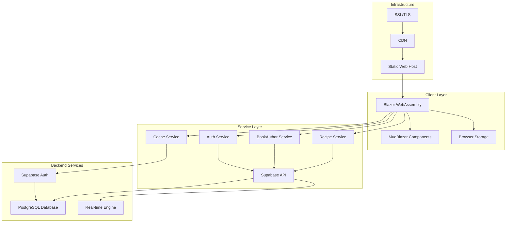

### Application Flow

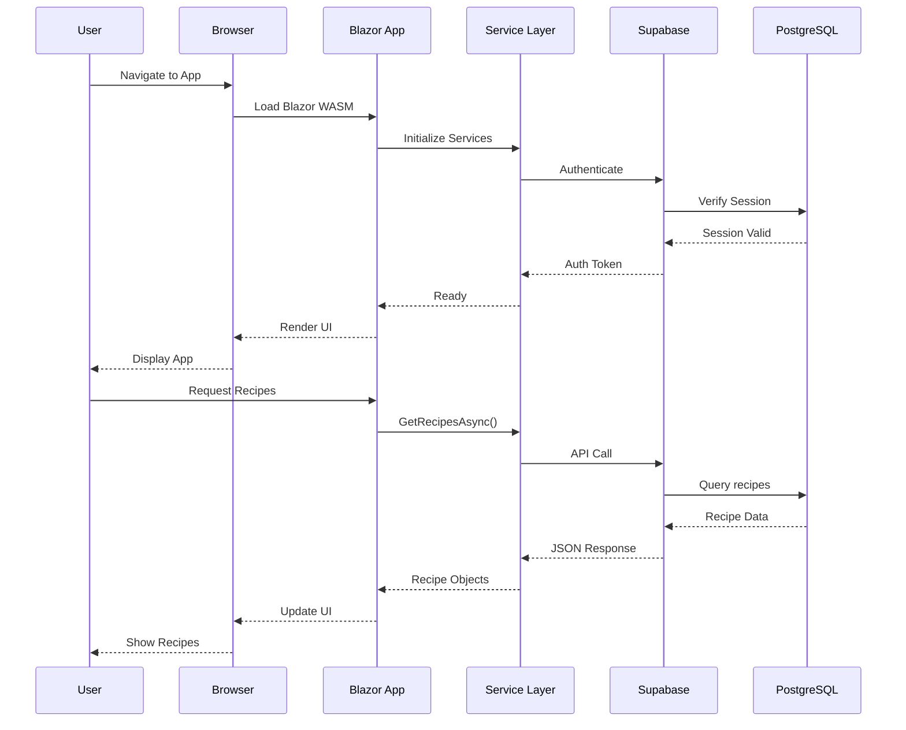

## 🎯 Architecture Patterns

### Clean Architecture Principles

The application follows Clean Architecture principles with clear separation of concerns:

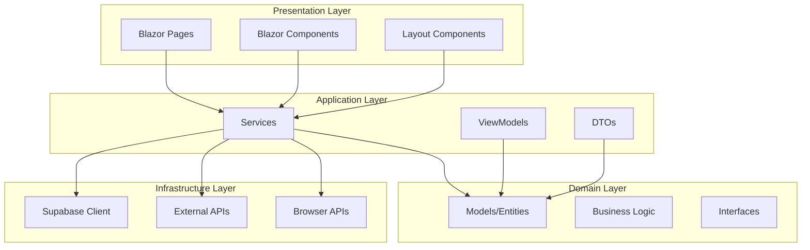

### Component-Based Architecture

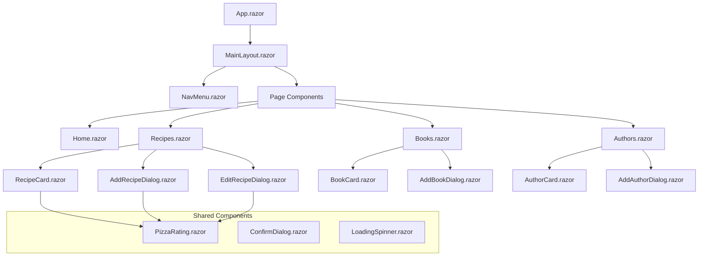

### Service-Oriented Design

```csharp
// Service Interface Pattern
public interface IRecipeService
{
    Task<List<Recipe>> GetRecipesAsync();
    Task<Recipe?> GetRecipeByIdAsync(int id);
    Task<Recipe> CreateRecipeAsync(Recipe recipe);
    Task<Recipe> UpdateRecipeAsync(Recipe recipe);
    Task<bool> DeleteRecipeAsync(int id);
}

// Service Implementation Pattern
public class RecipeService : IRecipeService
{
    private readonly SupabaseClient _supabaseClient;
    private readonly ILogger<RecipeService> _logger;
    
    public RecipeService(SupabaseClient supabaseClient, ILogger<RecipeService> logger)
    {
        _supabaseClient = supabaseClient;
        _logger = logger;
    }
    
    // Implementation methods...
}
```

## 🛠️ Technology Stack

### Frontend Technologies

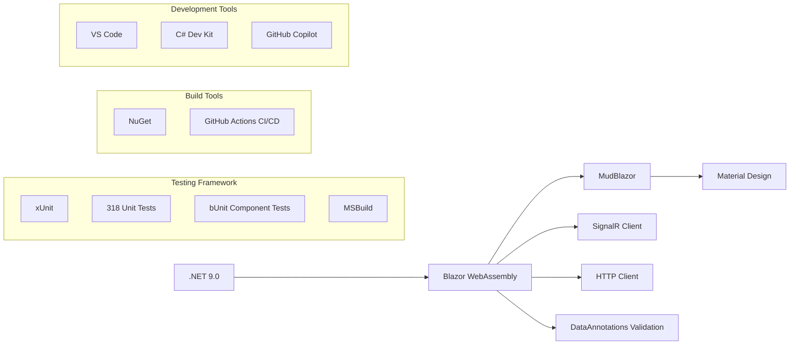

### Backend Technologies

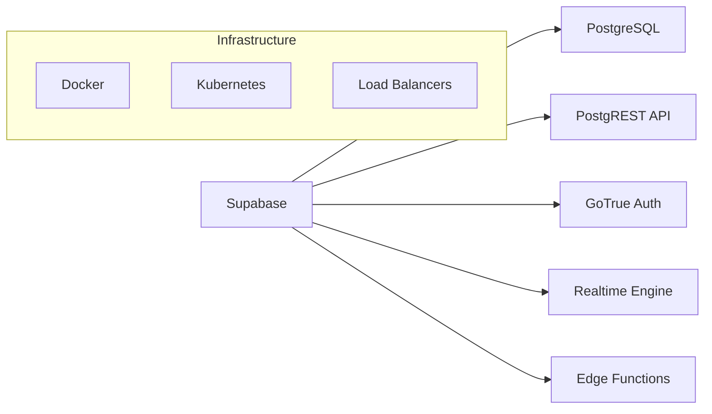

### Technology Decisions

| Technology | Decision | Rationale |
|------------|----------|-----------|
| **Frontend Framework** | Blazor WebAssembly | C# everywhere, strong typing, component-based |
| **UI Library** | MudBlazor | Material Design, rich components, good documentation |
| **Validation** | DataAnnotations | Built-in .NET validation, model-level constraints |
| **Testing Framework** | xUnit | Modern .NET testing, rich assertion library, parallel execution |
| **Backend** | Supabase | BaaS solution, PostgreSQL, auth included, real-time |
| **Database** | PostgreSQL | Relational data, ACID compliance, rich query capabilities |
| **Hosting** | Azure Static Web Apps | Cost-effective, global CDN, simple deployment, CI/CD integration |
| **CI/CD** | GitHub Actions | Integrated with repository, free tier, automated testing |

## 🗃️ Data Architecture

### Database Schema

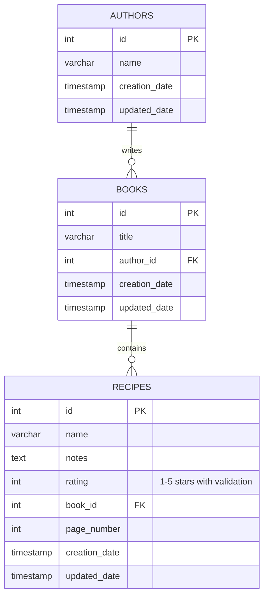

### Data Access Patterns

#### Repository Pattern (Alternative Implementation)

```csharp
public interface IRepository<T> where T : class
{
    Task<List<T>> GetAllAsync();
    Task<T?> GetByIdAsync(int id);
    Task<T> CreateAsync(T entity);
    Task<T> UpdateAsync(T entity);
    Task<bool> DeleteAsync(int id);
}

public class SupabaseRepository<T> : IRepository<T> where T : BaseModel, new()
{
    private readonly SupabaseClient _client;
    
    public SupabaseRepository(SupabaseClient client)
    {
        _client = client;
    }
    
    public async Task<List<T>> GetAllAsync()
    {
        var response = await _client.From<T>().Get();
        return response.Models ?? new List<T>();
    }
    
    // Other implementations...
}
```

#### Unit of Work Pattern

```csharp
public interface IUnitOfWork : IDisposable
{
    IRepository<Recipe> Recipes { get; }
    IRepository<Book> Books { get; }
    IRepository<Author> Authors { get; }
    Task<bool> SaveChangesAsync();
}

public class SupabaseUnitOfWork : IUnitOfWork
{
    private readonly SupabaseClient _client;
    private IRepository<Recipe>? _recipes;
    private IRepository<Book>? _books;
    private IRepository<Author>? _authors;
    
    public SupabaseUnitOfWork(SupabaseClient client)
    {
        _client = client;
    }
    
    public IRepository<Recipe> Recipes => 
        _recipes ??= new SupabaseRepository<Recipe>(_client);
    
    public IRepository<Book> Books => 
        _books ??= new SupabaseRepository<Book>(_client);
    
    public IRepository<Author> Authors => 
        _authors ??= new SupabaseRepository<Author>(_client);
    
    public async Task<bool> SaveChangesAsync()
    {
        // Supabase handles transactions internally
        return true;
    }
    
    public void Dispose()
    {
        // Cleanup if needed
    }
}
```

### Caching Strategy

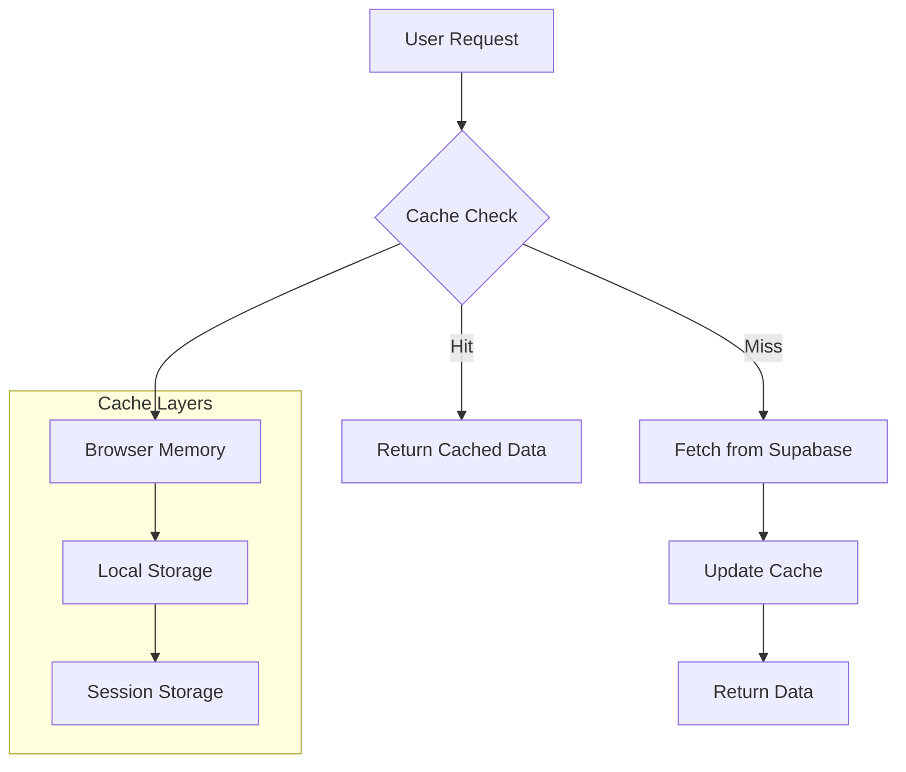

## 🧪 Testing Architecture

### Test Structure Overview

Our testing architecture ensures comprehensive coverage of business logic, validation rules, data relationships, and component behavior with **318 unit tests** organized across multiple test files and categories.

```mermaid
graph TB
    subgraph "Test Organization"
        A[Model Tests] --> A1[RecipeModelTests.cs]
        A --> A2[AuthorModelTests.cs]
        A --> A3[BookModelTests.cs]
        A --> A4[BookAuthorModelTests.cs]
        A --> A5[AdditionalModelValidationTests.cs]
        
        B[Validation Tests] --> B1[RecipeValidationTests.cs]
        B --> B2[RecipeRatingValidationTests.cs]
        
        C[Relationship Tests] --> C1[ModelRelationshipTests.cs]
        
        D[Service Tests] --> D1[RecipeServiceTests.cs]
        D --> D2[BookAuthorServiceTests.cs]
        D --> D3[CacheServiceTests.cs]
        D --> D4[SupabaseRecipesQueryTests.cs]
        D --> D5[ResultTests.cs]
        D --> D6[ServiceConstantsTests.cs]
        
        E[Component Tests] --> E1[EditRecipeDialogTests.cs]
        E --> E2[EditBookDialogTests.cs]
        E --> E3[EditAuthorDialogTests.cs]
        
        F[Exception Tests] --> F1[CustomExceptionTests.cs]
        
        G[Integration Tests] --> G1[ModelIntegrationTests.cs]
        
        H[Auth Tests] --> H1[AuthServiceTests.cs]
        H --> H2[SupabaseAuthWrapperTests.cs]
    end
    
    subgraph "Testing Framework"
        I[xUnit Framework]
        J[bUnit Component Testing]
        K[NSubstitute Mocking]
        L[Theory Data-Driven Tests]
        M[Arrange-Act-Assert Pattern]
        N[Validation Context Testing]
    end
    
    subgraph "CI/CD Integration"
        O[GitHub Actions]
        P[Automated Test Execution]
        Q[Test Results Reporting]
        R[Deployment Gating]
    end
    
    A1 --> I
    E1 --> J
    D1 --> K
    B1 --> L
    C1 --> M
    A --> N
    I --> O
    J --> P
    K --> Q
    L --> R
```

### Test Coverage Areas

| Test Category | Coverage | Test Files | Key Areas |
|---------------|----------|------------|-----------|
| **Model Validation** | Property validation, constraints, relationships | RecipeModelTests, AuthorModelTests, BookModelTests, BookAuthorModelTests, AdditionalModelValidationTests | DataAnnotations, business rules, navigation properties |
| **Rating Validation** | 1-5 star constraint testing | RecipeRatingValidationTests | Range validation, error messages |
| **Relationships** | Model associations and navigation | ModelRelationshipTests, ModelIntegrationTests | Foreign keys, collections, many-to-many |
| **Business Logic** | Core functionality testing | RecipeValidationTests | Complete validation scenarios |
| **Services** | Service layer operations | RecipeServiceTests, BookAuthorServiceTests, CacheServiceTests, SupabaseRecipesQueryTests, ResultTests, ServiceConstantsTests | CRUD operations, caching, queries, error handling |
| **Components** | Blazor component behavior | EditRecipeDialogTests, EditBookDialogTests, EditAuthorDialogTests | CreationDate preservation, UI rendering with bUnit |
| **Exceptions** | Custom exception validation | CustomExceptionTests | Exception properties, messages, inheritance |
| **Authentication** | Auth service functionality | AuthServiceTests, SupabaseAuthWrapperTests | User authentication, session management |
| **Integration** | Cross-cutting scenarios | ModelIntegrationTests | Recipe→Book→Author chains, relationship integrity |

### Validation Testing Strategy

```csharp
// Example: Comprehensive rating validation testing
[Theory]
[InlineData(1, true)]   // Valid: minimum
[InlineData(3, true)]   // Valid: middle
[InlineData(5, true)]   // Valid: maximum
[InlineData(0, false)]  // Invalid: below range
[InlineData(6, false)]  // Invalid: above range
[InlineData(-1, false)] // Invalid: negative
public void Rating_ShouldValidateRange_ForAllValues(int rating, bool isValid)
{
    // Comprehensive validation testing with expected outcomes
}
```

### CI/CD Testing Pipeline

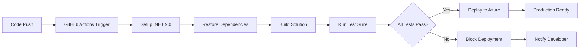

## 🔒 Security Considerations

### Authentication Flow

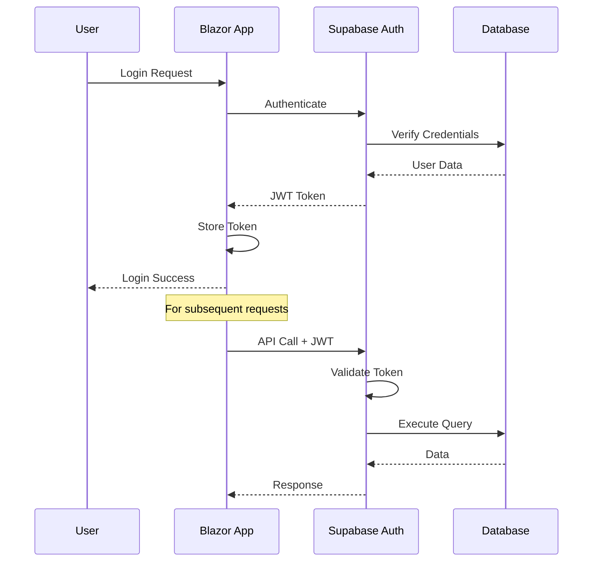

### Security Measures

#### Row Level Security (RLS)

```sql
-- Example RLS policies for Supabase
ALTER TABLE recipes ENABLE ROW LEVEL SECURITY;

-- Users can only see their own recipes
CREATE POLICY "Users can view own recipes" ON recipes
    FOR SELECT USING (auth.uid() = user_id);

-- Users can only insert their own recipes
CREATE POLICY "Users can insert own recipes" ON recipes
    FOR INSERT WITH CHECK (auth.uid() = user_id);

-- Users can only update their own recipes
CREATE POLICY "Users can update own recipes" ON recipes
    FOR UPDATE USING (auth.uid() = user_id);
```

#### Client-Side Security

```csharp
public class AuthService
{
    private readonly SupabaseClient _supabase;
    private User? _currentUser;
    
    public bool IsAuthenticated => _currentUser != null;
    public User? CurrentUser => _currentUser;
    
    public async Task<bool> SignInAsync(string email, string password)
    {
        try
        {
            var response = await _supabase.Auth.SignIn(email, password);
            _currentUser = response.User;
            return response.User != null;
        }
        catch
        {
            return false;
        }
    }
    
    public async Task SignOutAsync()
    {
        await _supabase.Auth.SignOut();
        _currentUser = null;
    }
}
```

#### Input Validation & Sanitization

```csharp
public static class ValidationExtensions
{
    public static bool IsValidRecipeName(this string name)
    {
        return !string.IsNullOrWhiteSpace(name) && 
               name.Length <= 255 && 
               !name.Contains("<") && 
               !name.Contains(">");
    }
    
    public static bool IsValidRating(this int rating)
    {
        return rating >= 1 && rating <= 5;
    }
    
    public static string SanitizeInput(this string input)
    {
        return WebUtility.HtmlEncode(input?.Trim() ?? string.Empty);
    }
}
```

## 🚀 Performance & Scalability

### Performance Optimization Strategies

#### Lazy Loading

```csharp
// Lazy load components
@page "/recipes"
@using Microsoft.AspNetCore.Components.Web.Virtualization

<Virtualize Items="recipes" Context="recipe">
    <RecipeCard Recipe="recipe" />
</Virtualize>
```

#### Data Pagination

```csharp
public async Task<PagedResult<Recipe>> GetRecipesPagedAsync(int page, int pageSize)
{
    var offset = (page - 1) * pageSize;
    
    var response = await _supabaseClient
        .From<Recipe>()
        .Range(offset, offset + pageSize - 1)
        .Get();
    
    return new PagedResult<Recipe>
    {
        Items = response.Models ?? new List<Recipe>(),
        CurrentPage = page,
        PageSize = pageSize,
        TotalCount = await GetTotalRecipeCountAsync()
    };
}
```

#### Caching Implementation

```csharp
public class CachedRecipeService : IRecipeService
{
    private readonly IRecipeService _recipeService;
    private readonly IMemoryCache _cache;
    private readonly TimeSpan _cacheExpiry = TimeSpan.FromMinutes(10);
    
    public async Task<List<Recipe>> GetRecipesAsync()
    {
        const string cacheKey = "all_recipes";
        
        if (_cache.TryGetValue(cacheKey, out List<Recipe>? cachedRecipes))
        {
            return cachedRecipes!;
        }
        
        var recipes = await _recipeService.GetRecipesAsync();
        _cache.Set(cacheKey, recipes, _cacheExpiry);
        
        return recipes;
    }
}
```

### Scalability Considerations

#### Database Optimization

```sql
-- Indexes for common queries
CREATE INDEX idx_recipes_rating ON recipes(rating);
CREATE INDEX idx_recipes_book_id ON recipes(book_id);
CREATE INDEX idx_recipes_creation_date ON recipes(creation_date);
CREATE INDEX idx_recipes_name_gin ON recipes USING gin(to_tsvector('english', name));

-- Full-text search index
CREATE INDEX idx_recipes_search ON recipes USING gin(
    to_tsvector('english', name || ' ' || coalesce(notes, ''))
);
```

#### API Rate Limiting

```csharp
public class RateLimitingService
{
    private readonly Dictionary<string, List<DateTime>> _requests = new();
    private readonly int _maxRequestsPerMinute = 100;
    
    public bool CanMakeRequest(string clientId)
    {
        var now = DateTime.UtcNow;
        var oneMinuteAgo = now.AddMinutes(-1);
        
        if (!_requests.ContainsKey(clientId))
        {
            _requests[clientId] = new List<DateTime>();
        }
        
        var clientRequests = _requests[clientId];
        clientRequests.RemoveAll(r => r < oneMinuteAgo);
        
        if (clientRequests.Count >= _maxRequestsPerMinute)
        {
            return false;
        }
        
        clientRequests.Add(now);
        return true;
    }
}
```

## 🚀 Deployment Architecture

### Deployment Pipeline

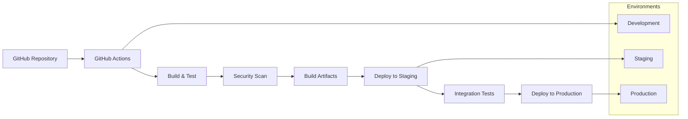

### Infrastructure as Code

```yaml
# GitHub Actions deployment workflow
name: Deploy to Production

on:
  push:
    branches: [main]

jobs:
  build-and-deploy:
    runs-on: ubuntu-latest
    
    steps:
    - uses: actions/checkout@v3
    
    - name: Setup .NET
      uses: actions/setup-dotnet@v3
      with:
        dotnet-version: '9.0.x'
    
    - name: Restore dependencies
      run: dotnet restore
    
    - name: Build
      run: dotnet build --no-restore
    
    - name: Test
      run: dotnet test --no-build --verbosity normal
    
    - name: Publish
      run: dotnet publish -c Release -o ./publish
    
    - name: Deploy to hosting
      uses: peaceiris/actions-gh-pages@v3
      with:
        github_token: ${{ secrets.GITHUB_TOKEN }}
        publish_dir: ./publish/wwwroot
```

### Monitoring & Observability

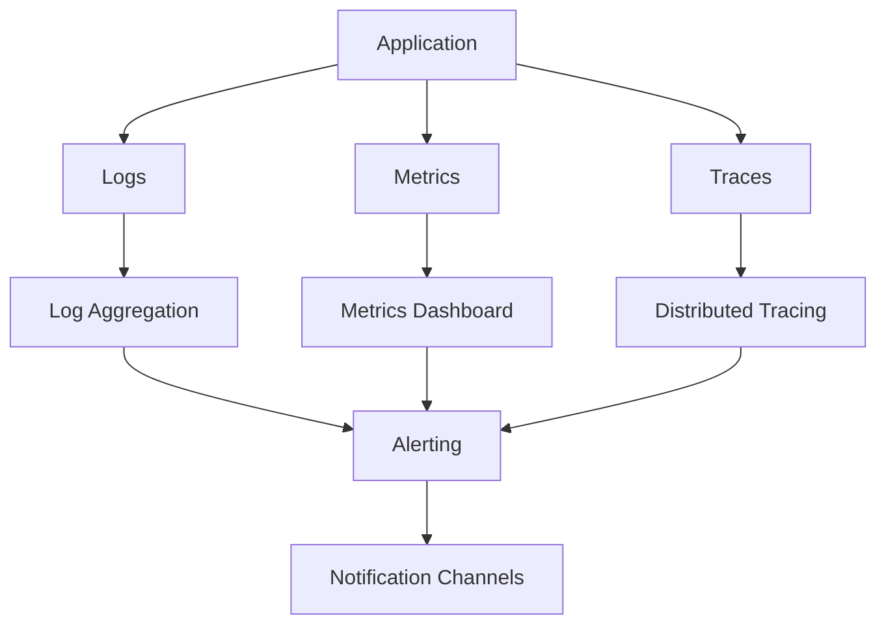

#### Logging Strategy

```csharp
public class RecipeService
{
    private readonly ILogger<RecipeService> _logger;
    
    public async Task<Recipe> CreateRecipeAsync(Recipe recipe)
    {
        _logger.LogInformation("Creating recipe: {RecipeName}", recipe.Name);
        
        try
        {
            var result = await _supabaseClient.From<Recipe>().Insert(recipe);
            _logger.LogInformation("Recipe created successfully: {RecipeId}", result.Model?.Id);
            return result.Model!;
        }
        catch (Exception ex)
        {
            _logger.LogError(ex, "Failed to create recipe: {RecipeName}", recipe.Name);
            throw;
        }
    }
}
```

---

For more information, see:
- [Main Documentation](README.md)
- [Development Guide](DEVELOPMENT.md)
- [API Reference](API.md)
