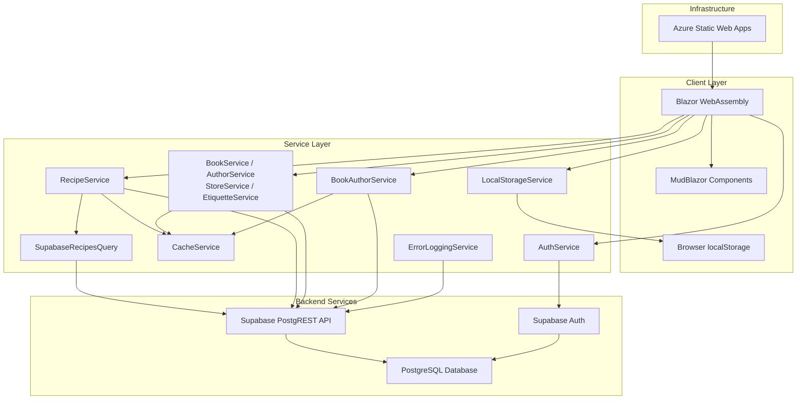
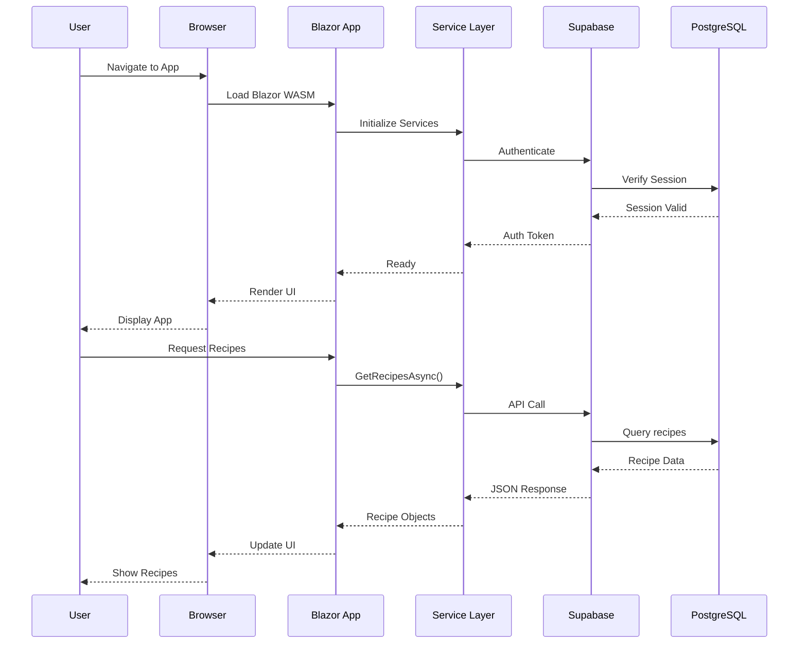
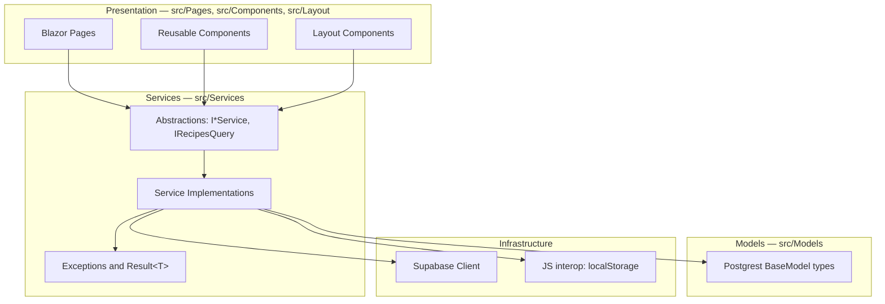
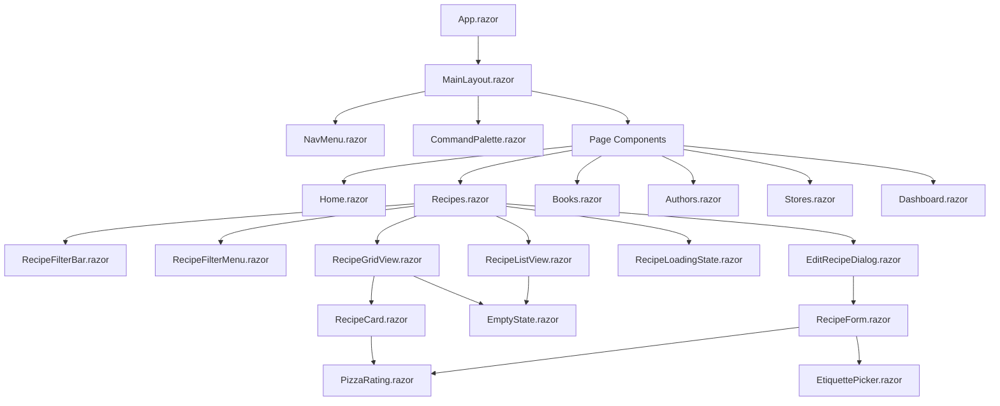
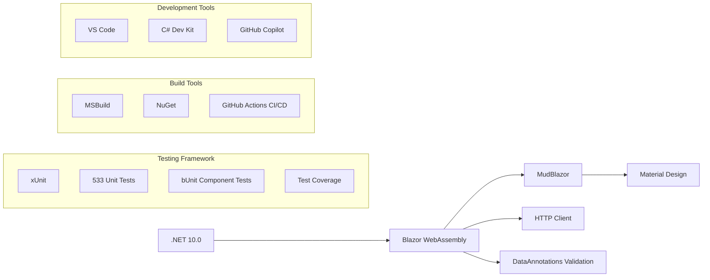
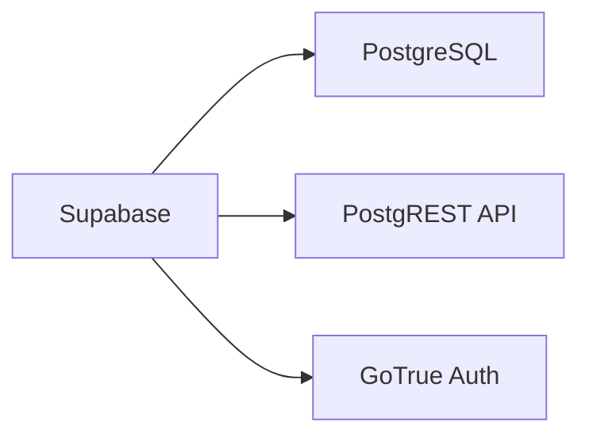
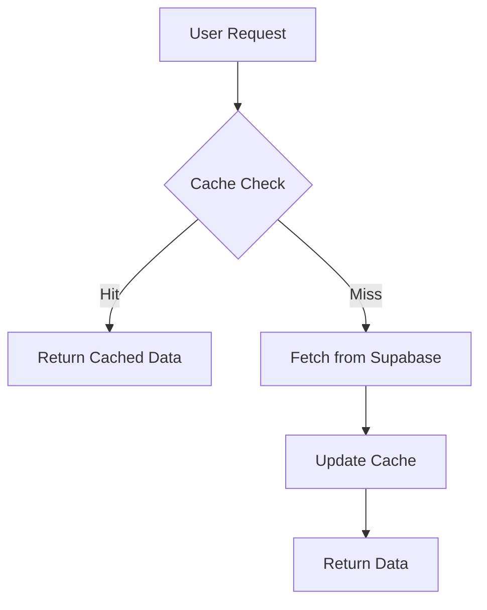
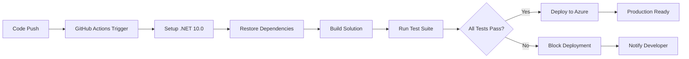

# Architecture Guide

This document describes the system architecture, design decisions, and technical considerations for the Mes Recettes application.

## 📋 Table of Contents

- [System Overview](#system-overview)
- [Architecture Patterns](#architecture-patterns)
- [Technology Stack](#technology-stack)
- [Data Architecture](#data-architecture)
- [Testing Architecture](#testing-architecture)
- [Security Considerations](#security-considerations)
- [Performance & Scalability](#performance--scalability)
- [Deployment Architecture](#deployment-architecture)

## 🏗️ System Overview

Mes Recettes is built as a Single Page Application (SPA) using Blazor WebAssembly, providing a rich client-side experience while leveraging Supabase as a Backend-as-a-Service (BaaS) solution.

### High-Level Architecture


```mermaid
graph TB
    subgraph "Client Layer"
        BlazorApp[Blazor WebAssembly]
        Mud[MudBlazor Components]
        Storage[Browser localStorage]
    end

    subgraph "Service Layer"
        RecipeSvc[RecipeService]
        CrudSvc[BookService / AuthorService<br/>StoreService / EtiquetteService]
        BookAuthorSvc[BookAuthorService]
        AuthSvc[AuthService]
        CacheSvc[CacheService]
        Query[SupabaseRecipesQuery]
        LocalSvc[LocalStorageService]
        ErrorSvc[ErrorLoggingService]
    end

    subgraph "Backend Services"
        Rest[Supabase PostgREST API]
        GoTrue[Supabase Auth]
        Postgres[PostgreSQL Database]
    end

    subgraph "Infrastructure"
        Swa[Azure Static Web Apps]
    end

    BlazorApp --> Mud
    BlazorApp --> RecipeSvc
    BlazorApp --> CrudSvc
    BlazorApp --> BookAuthorSvc
    BlazorApp --> AuthSvc
    BlazorApp --> LocalSvc
    LocalSvc --> Storage

    RecipeSvc --> Query
    RecipeSvc --> CacheSvc
    CrudSvc --> CacheSvc
    BookAuthorSvc --> CacheSvc

    Query --> Rest
    RecipeSvc --> Rest
    CrudSvc --> Rest
    BookAuthorSvc --> Rest
    ErrorSvc --> Rest
    AuthSvc --> GoTrue

    Rest --> Postgres
    GoTrue --> Postgres

    Swa --> BlazorApp
```

### Application Flow


```mermaid
sequenceDiagram
    participant U as User
    participant B as Browser
    participant BA as Blazor App
    participant S as Service Layer
    participant SB as Supabase
    participant DB as PostgreSQL
    
    U->>B: Navigate to App
    B->>BA: Load Blazor WASM
    BA->>S: Initialize Services
    S->>SB: Authenticate
    SB->>DB: Verify Session
    DB-->>SB: Session Valid
    SB-->>S: Auth Token
    S-->>BA: Ready
    BA-->>B: Render UI
    B-->>U: Display App
    
    U->>BA: Request Recipes
    BA->>S: GetRecipesAsync()
    S->>SB: API Call
    SB->>DB: Query recipes
    DB-->>SB: Recipe Data
    SB-->>S: JSON Response
    S-->>BA: Recipe Objects
    BA-->>B: Update UI
    B-->>U: Show Recipes
```

## 🎯 Architecture Patterns

### Layering

The project is a single Blazor WebAssembly assembly, organised by folder rather
than split into projects:


```mermaid
graph TD
    subgraph "Presentation — src/Pages, src/Components, src/Layout"
        Pages[Blazor Pages]
        Components[Reusable Components]
        LayoutC[Layout Components]
    end

    subgraph "Services — src/Services"
        Services[Service Implementations]
        Interfaces[Abstractions: I*Service, IRecipesQuery]
        Errors[Exceptions and Result&lt;T&gt;]
    end

    subgraph "Models — src/Models"
        Models[Postgrest BaseModel types]
    end

    subgraph "Infrastructure"
        Client[Supabase Client]
        Js[JS interop: localStorage]
    end

    Pages --> Interfaces
    Components --> Interfaces
    LayoutC --> Interfaces
    Interfaces --> Services
    Services --> Errors
    Services --> Models
    Services --> Client
    Services --> Js
```

Pages depend on interfaces, never on concrete services; the container in
`src/Program.cs` supplies the implementations, which is what makes the services
substitutable with NSubstitute in the test project.

### Component-Based Architecture


```mermaid
graph TD
    App[App.razor] --> Layout[MainLayout.razor]
    Layout --> Nav[NavMenu.razor]
    Layout --> Palette[CommandPalette.razor]
    Layout --> Pages[Page Components]

    Pages --> Home[Home.razor]
    Pages --> Recipes[Recipes.razor]
    Pages --> Books[Books.razor]
    Pages --> Authors[Authors.razor]
    Pages --> Stores[Stores.razor]
    Pages --> Dashboard[Dashboard.razor]

    Recipes --> FilterBar[RecipeFilterBar.razor]
    Recipes --> FilterMenu[RecipeFilterMenu.razor]
    Recipes --> Grid[RecipeGridView.razor]
    Recipes --> ListView[RecipeListView.razor]
    Recipes --> Loading[RecipeLoadingState.razor]
    Recipes --> EditDialog[EditRecipeDialog.razor]

    Grid --> Card[RecipeCard.razor]
    Card --> Rating[PizzaRating.razor]
    EditDialog --> Form[RecipeForm.razor]
    Form --> Rating
    Form --> Etiquettes[EtiquettePicker.razor]

    Grid --> Empty[EmptyState.razor]
    ListView --> Empty
```


### Service-Oriented Design

Every service sits behind an interface in `src/Services/Abstractions/`, is
registered in `src/Program.cs`, and returns a `Result<T>` rather than throwing
for expected failures. `BookService`, `AuthorService`, `StoreService` and
`EtiquetteService` derive from `CrudServiceBase<TModel, TService>`, which
centralises logging, error mapping and `CancellationToken` propagation.
`RecipeService` composes `IRecipesQuery` and `ICacheService` instead. The full
interfaces are in [API.md](API.md).

### Component Architecture Example: Recipes Page Refactoring

The `Recipes.razor` page demonstrates our preferred component architecture, moving from a monolithic page to a composed UI.

#### Before Refactoring
- **Monolithic**: Single file with 800+ lines.
- **Mixed Concerns**: UI logic, data loading, state management all mixed.
- **Hard to Maintain**: Difficult to find specific logic or add features.

#### After Refactoring
- **Parent Component (`Recipes.razor`)**: Handles state management, data loading orchestration, and business logic.
- **Child Components**:
    - `RecipeFilterBar`: Search field, quick filter chips.
    - `RecipeFilterMenu`: Dropdown filters and the mobile filter sheet.
    - `RecipeLoadingState` / `RecipeCardSkeleton`: Skeletons.
    - `RecipeGridView` / `RecipeListView`: Data display.
    - `EmptyState`: Reused empty state.

#### Data Flow
1. **User Action** (e.g., clicks filter) -> **Child Component** emits event.
2. **Parent Component** handles event -> Updates State -> Reloads Data if needed.
3. **Parent Component** passes new data/state down to **Child Components** via parameters.

This Unidirectional Data Flow ensures predictability and easier debugging.

## 🛠️ Technology Stack

### Frontend Technologies


```mermaid
graph LR
    Net[.NET 10.0] --> Wasm[Blazor WebAssembly]
    Wasm --> Mud[MudBlazor]
    Mud --> Material[Material Design]
    Wasm --> Http[HTTP Client]
    Wasm --> Annotations[DataAnnotations Validation]

    subgraph "Testing Framework"
        XUnit[xUnit]
        UnitTests[533 Unit Tests]
        BUnit[bUnit Component Tests]
        Coverage[Test Coverage]
    end

    subgraph "Build Tools"
        MsBuild[MSBuild]
        NuGet[NuGet]
        Actions[GitHub Actions CI/CD]
    end

    subgraph "Development Tools"
        VsCode[VS Code]
        DevKit[C# Dev Kit]
        Copilot[GitHub Copilot]
    end
```

### Backend Technologies


```mermaid
graph LR
    A[Supabase] --> B[PostgreSQL]
    A --> C[PostgREST API]
    A --> D[GoTrue Auth]
```

### Technology Decisions

| Technology | Decision | Rationale |
|------------|----------|-----------|
| **Frontend Framework** | Blazor WebAssembly | C# everywhere, strong typing, component-based |
| **UI Library** | MudBlazor | Material Design, rich components, good documentation |
| **Validation** | DataAnnotations | Built-in .NET validation, model-level constraints |
| **Testing Framework** | xUnit | Modern .NET testing, rich assertion library, parallel execution |
| **Backend** | Supabase | BaaS solution, PostgreSQL, auth included |
| **Database** | PostgreSQL | Relational data, ACID compliance, rich query capabilities |
| **Hosting** | Azure Static Web Apps | Cost-effective, global CDN, simple deployment, CI/CD integration |
| **CI/CD** | GitHub Actions | Integrated with repository, free tier, automated testing |

## 🗃️ Data Architecture

### Database Schema

Eight tables in `public`: `recettes`, `authors`, `books`, `books_authors`,
`stores`, `etiquettes`, `recettes_etiquettes` and `app_logs`. The authoritative
definition is the setup script in the [README](../README.md), generated from the
live schema; [API.md](API.md) maps those tables onto the C# models.

### Caching Strategy


```mermaid
graph TD
    A[User Request] --> B{Cache Check}
    B -->|Hit| C[Return Cached Data]
    B -->|Miss| D[Fetch from Supabase]
    D --> E[Update Cache]
    E --> F[Return Data]
```

`CacheService` is a single in-memory layer: a `ConcurrentDictionary` of entries
with a TTL, discarded on reload. `LocalStorageService` is separate and is not a
cache tier — it persists favourites, recently viewed recipes and the recipe
list view mode across sessions.

## 🧪 Testing Architecture

### Test Structure Overview

Our testing architecture ensures comprehensive coverage of business logic, validation rules, data relationships, and component behavior with **533 unit tests** organized across multiple test files and categories (counted via `dotnet test --list-tests | Measure-Object`).


```mermaid
graph TB
    subgraph "Test Organization"
        A[Model Tests] --> A1[RecipeModelTests.cs]
        A --> A2[AuthorModelTests.cs]
        A --> A3[BookModelTests.cs]
        A --> A4[BookAuthorModelTests.cs]
        A --> A5[AdditionalModelValidationTests.cs]
        
        B[Validation Tests] --> B1[RecipeValidationTests.cs]
        B --> B2[RecipeRatingValidationTests.cs]
        
        C[Relationship Tests] --> C1[ModelRelationshipTests.cs]
        
        D[Service Tests] --> D1[RecipeServiceTests.cs]
        D --> D2[BookAuthorServiceTests.cs]
        D --> D3[CacheServiceTests.cs]
        D --> D4[SupabaseRecipesQueryTests.cs]
        D --> D5[ResultTests.cs]
        D --> D6[ServiceConstantsTests.cs]
        
        E[Component Tests] --> E1[EditRecipeDialogTests.cs]
        E --> E2[EditBookDialogTests.cs]
        E --> E3[EditAuthorDialogTests.cs]
        
        F[Exception Tests] --> F1[CustomExceptionTests.cs]
        
        G[Integration Tests] --> G1[ModelIntegrationTests.cs]
        
        H[Auth Tests] --> H1[AuthServiceTests.cs]
        H --> H2[SupabaseAuthWrapperTests.cs]
    end
    
    subgraph "Testing Framework"
        I[xUnit Framework]
        J[bUnit Component Testing]
        K[NSubstitute Mocking]
        L[Theory Data-Driven Tests]
        M[Arrange-Act-Assert Pattern]
        N[Validation Context Testing]
    end
    
    subgraph "CI/CD Integration"
        O[GitHub Actions]
        P[Automated Test Execution]
        Q[Test Results Reporting]
        R[Deployment Gating]
    end
    
    A1 --> I
    E1 --> J
    D1 --> K
    B1 --> L
    C1 --> M
    A --> N
    I --> O
    J --> P
    K --> Q
    L --> R
```

### Test Coverage Areas

| Test Category | Coverage | Test Files | Key Areas |
|---------------|----------|------------|-----------|
| **Model Validation** | Property validation, constraints, relationships | RecipeModelTests, AuthorModelTests, BookModelTests, BookAuthorModelTests, AdditionalModelValidationTests | DataAnnotations, business rules, navigation properties |
| **Rating Validation** | 1-5 star constraint testing | RecipeRatingValidationTests | Range validation, error messages |
| **Relationships** | Model associations and navigation | ModelRelationshipTests, ModelIntegrationTests | Foreign keys, collections, many-to-many |
| **Business Logic** | Core functionality testing | RecipeValidationTests | Complete validation scenarios |
| **Services** | Service layer operations | RecipeServiceTests, BookAuthorServiceTests, CacheServiceTests, SupabaseRecipesQueryTests, ResultTests, ServiceConstantsTests | CRUD operations, caching, queries, error handling |
| **Components** | Blazor component behavior | EditRecipeDialogTests, EditBookDialogTests, EditAuthorDialogTests | CreationDate preservation, UI rendering with bUnit |
| **Exceptions** | Custom exception validation | CustomExceptionTests | Exception properties, messages, inheritance |
| **Authentication** | Auth service functionality | AuthServiceTests, SupabaseAuthWrapperTests | User authentication, session management |
| **Integration** | Cross-cutting scenarios | ModelIntegrationTests | Recipe→Book→Author chains, relationship integrity |

### Validation Testing Strategy

Validation is tested through the data annotations on the models, with separate
theories for accepted and rejected values. From
`tests/RecipeRatingValidationTests.cs`:

```csharp
[Theory]
[InlineData(1)]
[InlineData(2)]
[InlineData(3)]
[InlineData(4)]
[InlineData(5)]
public void Recipe_ValidRating_ShouldBeAccepted(int validRating)

[Theory]
[InlineData(-5)]
[InlineData(-1)]
[InlineData(6)]
[InlineData(10)]
[InlineData(100)]
public void Recipe_InvalidRating_ModelStillAcceptsButValidationWillFail(int invalidRating)
```

`Recipe.Rating` carries `[Range(0, 5)]`, so 0 is a valid value meaning "not
rated"; the database column defaults to it.

### CI/CD Testing Pipeline


```mermaid
flowchart LR
    A[Code Push] --> B[GitHub Actions Trigger]
    B --> C[Setup .NET 10.0]
    C --> D[Restore Dependencies]
    D --> E[Build Solution]
    E --> F[Run Test Suite]
    F --> G{All Tests Pass?}
    G -->|Yes| H[Deploy to Azure]
    G -->|No| I[Block Deployment]
    I --> J[Notify Developer]
    H --> K[Production Ready]
```

## 🔒 Security Considerations

The application is a Blazor WebAssembly client talking straight to Supabase,
with no server of our own in between. The anon key ships inside the WASM bundle
and is public by design; Row Level Security is therefore the only authorization
layer. Read access is public, writes require an authenticated session, and
there is no per-row ownership.

The access model, the policies in force on all eight tables, the `authenticated`
role's limits and the procedure for verifying RLS from outside the app are
documented in **[SECURITY.md](SECURITY.md)**.

## 🚀 Performance & Scalability

Recipes are never loaded as a whole table. `IRecipesQuery.SearchAsync` pushes
filtering, sorting and pagination into PostgREST, and `RecipeService` exposes
`GetRecipeSummariesAsync` for the dashboard and store counts, which selects only
`id`, `book_id`, `store_id`, `rating` and `created_at` instead of full recipes.
`BookAuthorService.LoadAuthorsForBooksAsync` loads the authors of many books in
two queries rather than one pair per book. See [API.md](API.md) for the service
signatures.

On the database side, the indexes backing these queries — including the French
full-text index on `name` and `notes` — are created by the setup script in the
[README](../README.md) and by `database/migrations/add_indexes.sql`.

## 🚀 Deployment Architecture

Pushes to `main` are built, tested and deployed to Azure Static Web Apps by
`.github/workflows/azure-static-web-apps-green-pond-067ed2010.yml`, with the
test job gating the deploy job. See [DEPLOYMENT.md](DEPLOYMENT.md).

### Error Logging

`ErrorLoggingService` writes caught exceptions to the `app_logs` table through
PostgREST, recording level, message, context and stack trace. Its policies only
admit an authenticated session, so logging from the anonymous read path is
dropped — see [SECURITY.md](SECURITY.md).


For more information, see:
- [Main Documentation](README.md)
- [Development Guide](DEVELOPMENT.md)
- [API Reference](API.md)
- [Security Model](SECURITY.md)
