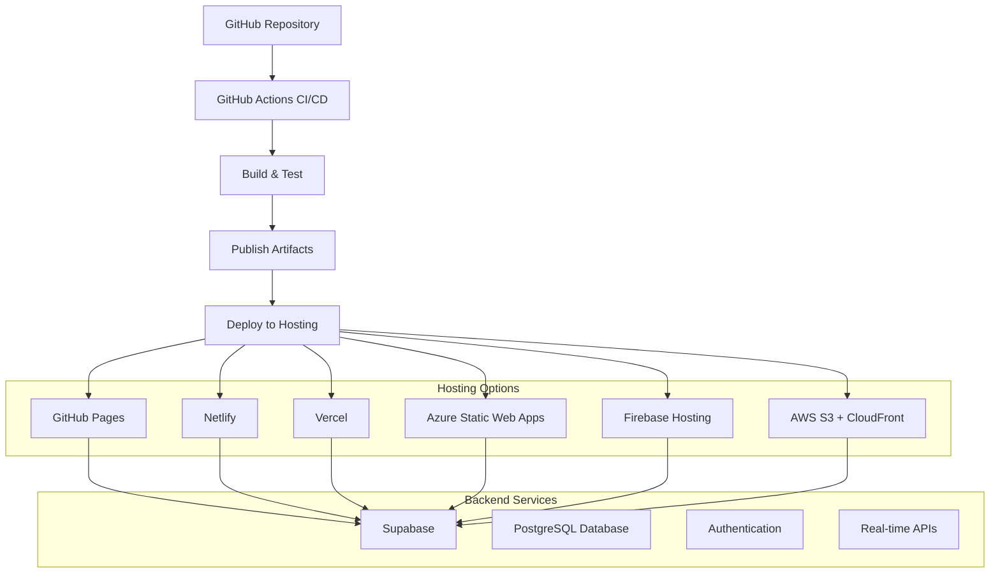

# Deployment Guide

This guide covers deployment strategies, hosting options, and CI/CD setup for the Mes Recettes application.

## 📋 Table of Contents

- [Deployment Overview](#deployment-overview)
- [Prerequisites](#prerequisites)
- [Static Web Hosting](#static-web-hosting)
- [CI/CD Setup](#cicd-setup)
- [Environment Configuration](#environment-configuration)
- [Performance Optimization](#performance-optimization)
- [Monitoring & Maintenance](#monitoring--maintenance)

## 🎯 Deployment Overview

Mes Recettes is a Blazor WebAssembly application that compiles to static files, making it ideal for deployment on static web hosts, CDNs, or any web server capable of serving static content.

### Deployment Architecture



## 📋 Prerequisites

### Development Environment
- .NET 9.0 SDK or later
- Git version control
- Code editor (VS Code recommended)

### Hosting Requirements
- Static web hosting service
- Custom domain (optional)
- SSL certificate (usually provided by hosting service)

### Backend Services
- Supabase project with configured database
- Environment variables for API keys
- CORS configuration for your domain

## 🌐 Static Web Hosting

### Option 1: GitHub Pages

**Advantages:**
- Free hosting for public repositories
- Integrated with GitHub Actions
- Custom domain support
- Automatic SSL certificates

**Setup:**

1. **Enable GitHub Pages in repository settings**
2. **Create deployment workflow:**

```yaml
# .github/workflows/deploy.yml
name: Deploy to GitHub Pages

on:
  push:
    branches: [main]
  pull_request:
    branches: [main]

jobs:
  deploy:
    runs-on: ubuntu-latest
    
    steps:
    - name: Checkout
      uses: actions/checkout@v4
    
    - name: Setup .NET
      uses: actions/setup-dotnet@v3
      with:
        dotnet-version: '9.0.x'
    
    - name: Restore dependencies
      run: dotnet restore
    
    - name: Build
      run: dotnet build --configuration Release --no-restore
    
    - name: Test
      run: dotnet test --no-build --verbosity normal
    
    - name: Publish
      run: dotnet publish RecettesIndex.csproj -c Release -o dist --nologo
    
    - name: Change base-tag in index.html
      run: sed -i 's/<base href="\/" \/>/<base href="\/RecettesIndex\/" \/>/g' dist/wwwroot/index.html
    
    - name: Add .nojekyll file
      run: touch dist/wwwroot/.nojekyll
    
    - name: Deploy to GitHub Pages
      uses: peaceiris/actions-gh-pages@v3
      if: github.ref == 'refs/heads/main'
      with:
        github_token: ${{ secrets.GITHUB_TOKEN }}
        publish_dir: dist/wwwroot
```

3. **Configure base path in index.html:**

```html
<!-- For GitHub Pages with repository name -->
<base href="/RecettesIndex/" />

<!-- For custom domain -->
<base href="/" />
```

### Option 2: Netlify

**Advantages:**
- Easy deployment from Git
- Automatic builds and deployments
- Edge functions support
- Form handling capabilities

**Setup:**

1. **Connect repository to Netlify**
2. **Configure build settings:**

```toml
# netlify.toml
[build]
  command = "dotnet publish -c Release -o dist"
  publish = "dist/wwwroot"

[build.environment]
  DOTNET_VERSION = "9.0.x"

[[redirects]]
  from = "/*"
  to = "/index.html"
  status = 200
```

3. **Environment variables in Netlify dashboard:**
```
SUPABASE_URL=your_supabase_url
SUPABASE_ANON_KEY=your_supabase_anon_key
```

### Option 3: Azure Static Web Apps

**Advantages:**
- Integrated with Azure ecosystem
- Built-in authentication
- API support with Azure Functions
- Global CDN distribution

**Setup:**

1. **Create Azure Static Web App resource**

2. **Configure routing for client-side navigation**

Create `staticwebapp.config.json` in `wwwroot/`:

```json
{
  "navigationFallback": {
    "rewrite": "/index.html",
    "exclude": ["/_framework/*", "/css/*", "/lib/*", "/icons/*", "*.{css,scss,js,png,gif,ico,jpg,svg,woff,woff2,ttf,eot}"]
  },
  "mimeTypes": {
    ".dll": "application/octet-stream",
    ".wasm": "application/wasm",
    ".json": "application/json"
  }
}
```

This configuration ensures:
- Deep linking works correctly for Blazor routes
- Static assets are properly excluded from navigation fallback
- Correct MIME types for WebAssembly files

3. **Configure GitHub Actions workflow:**

```yaml
# .github/workflows/azure-static-web-apps.yml
name: Azure Static Web Apps CI/CD

on:
  push:
    branches: [main]
  pull_request:
    types: [opened, synchronize, reopened, closed]
    branches: [main]

jobs:
  build_and_deploy_job:
    if: github.event_name == 'push' || (github.event_name == 'pull_request' && github.event.action != 'closed')
    runs-on: ubuntu-latest
    name: Build and Deploy Job
    steps:
    - uses: actions/checkout@v3
      with:
        submodules: true
    
    - name: Build And Deploy
      id: builddeploy
      uses: Azure/static-web-apps-deploy@v1
      with:
        azure_static_web_apps_api_token: ${{ secrets.AZURE_STATIC_WEB_APPS_API_TOKEN }}
        repo_token: ${{ secrets.GITHUB_TOKEN }}
        action: "upload"
        app_location: "/"
        output_location: "wwwroot"
        app_build_command: "dotnet publish -c Release -o published"

  close_pull_request_job:
    if: github.event_name == 'pull_request' && github.event.action == 'closed'
    runs-on: ubuntu-latest
    name: Close Pull Request Job
    steps:
    - name: Close Pull Request
      id: closepullrequest
      uses: Azure/static-web-apps-deploy@v1
      with:
        azure_static_web_apps_api_token: ${{ secrets.AZURE_STATIC_WEB_APPS_API_TOKEN }}
        action: "close"
```

### Option 4: Vercel

**Advantages:**
- Zero-configuration deployments
- Edge functions support
- Real-time collaboration
- Automatic performance optimization

**Setup:**

1. **Install Vercel CLI:**
```bash
npm i -g vercel
```

2. **Configure vercel.json:**
```json
{
  "buildCommand": "dotnet publish -c Release -o dist",
  "outputDirectory": "dist/wwwroot",
  "installCommand": "echo 'No install command'",
  "routes": [
    {
      "src": "/[^.]+",
      "dest": "/",
      "status": 200
    }
  ]
}
```

3. **Deploy:**
```bash
vercel --prod
```

## 🔧 CI/CD Setup

### Comprehensive GitHub Actions Workflow

```yaml
name: CI/CD Pipeline

on:
  push:
    branches: [main, develop]
  pull_request:
    branches: [main, develop]

env:
  DOTNET_VERSION: '9.0.x'

jobs:
  test:
    runs-on: ubuntu-latest
    name: Test
    
    steps:
    - name: Checkout
      uses: actions/checkout@v4
    
    - name: Setup .NET
      uses: actions/setup-dotnet@v3
      with:
        dotnet-version: ${{ env.DOTNET_VERSION }}
    
    - name: Restore dependencies
      run: dotnet restore
    
    - name: Build
      run: dotnet build --no-restore
    
    - name: Run tests
      run: dotnet test --no-build --verbosity normal --collect:"XPlat Code Coverage"
    
    - name: Upload coverage reports
      uses: codecov/codecov-action@v3
      with:
        file: coverage.cobertura.xml
        fail_ci_if_error: true

  security-scan:
    runs-on: ubuntu-latest
    name: Security Scan
    
    steps:
    - name: Checkout
      uses: actions/checkout@v4
    
    - name: Run Trivy vulnerability scanner
      uses: aquasecurity/trivy-action@master
      with:
        scan-type: 'fs'
        format: 'sarif'
        output: 'trivy-results.sarif'
    
    - name: Upload Trivy scan results
      uses: github/codeql-action/upload-sarif@v2
      with:
        sarif_file: 'trivy-results.sarif'

  build-and-deploy:
    needs: [test, security-scan]
    runs-on: ubuntu-latest
    name: Build and Deploy
    if: github.ref == 'refs/heads/main'
    
    steps:
    - name: Checkout
      uses: actions/checkout@v4
    
    - name: Setup .NET
      uses: actions/setup-dotnet@v3
      with:
        dotnet-version: ${{ env.DOTNET_VERSION }}
    
    - name: Restore dependencies
      run: dotnet restore
    
    - name: Build
      run: dotnet build --configuration Release --no-restore
    
    - name: Publish
      run: dotnet publish -c Release -o ./dist
    
    - name: Deploy to hosting
      uses: peaceiris/actions-gh-pages@v3
      with:
        github_token: ${{ secrets.GITHUB_TOKEN }}
        publish_dir: ./dist/wwwroot
        cname: your-domain.com # Optional: for custom domain
```

### Multi-Environment Deployment

```yaml
name: Multi-Environment Deployment

on:
  push:
    branches: [main, develop, staging]

jobs:
  deploy:
    runs-on: ubuntu-latest
    
    strategy:
      matrix:
        environment: 
          - name: development
            branch: develop
            url: https://dev-recettes.example.com
          - name: staging
            branch: staging
            url: https://staging-recettes.example.com
          - name: production
            branch: main
            url: https://recettes.example.com
    
    environment:
      name: ${{ matrix.environment.name }}
      url: ${{ matrix.environment.url }}
    
    if: github.ref == format('refs/heads/{0}', matrix.environment.branch)
    
    steps:
    - name: Checkout
      uses: actions/checkout@v4
    
    - name: Setup .NET
      uses: actions/setup-dotnet@v3
      with:
        dotnet-version: '9.0.x'
    
    - name: Build and publish
      run: |
        dotnet restore
        dotnet publish -c Release -o ./dist
    
    - name: Deploy
      run: |
        echo "Deploying to ${{ matrix.environment.name }}"
        # Add deployment commands here
```

## ⚙️ Environment Configuration

### appsettings.json Structure

```json
{
  "Logging": {
    "LogLevel": {
      "Default": "Information",
      "Microsoft.AspNetCore": "Warning"
    }
  },
  "Supabase": {
    "Url": "https://your-project.supabase.co",
    "Key": "your-anon-key"
  },
  "AppSettings": {
    "AppName": "Mes Recettes",
    "Version": "1.0.0",
    "Environment": "Production"
  }
}
```

### Environment-Specific Configuration

```json
// appsettings.Development.json
{
  "Logging": {
    "LogLevel": {
      "Default": "Debug",
      "Microsoft.AspNetCore": "Information"
    }
  },
  "Supabase": {
    "Url": "https://dev-project.supabase.co",
    "Key": "dev-anon-key"
  }
}

// appsettings.Production.json
{
  "Logging": {
    "LogLevel": {
      "Default": "Warning",
      "Microsoft.AspNetCore": "Error"
    }
  },
  "Supabase": {
    "Url": "https://prod-project.supabase.co",
    "Key": "prod-anon-key"
  }
}
```

### Secure Configuration Management

```csharp
// Program.cs - Configuration setup
var builder = WebAssemblyHostBuilder.CreateDefault(args);

// Load configuration from multiple sources
builder.Configuration
    .AddJsonFile("appsettings.json", optional: false, reloadOnChange: true)
    .AddJsonFile($"appsettings.{builder.HostEnvironment.Environment}.json", optional: true)
    .AddEnvironmentVariables(); // For hosting platforms that support env vars

// Configure services with options pattern
builder.Services.Configure<SupabaseConfig>(
    builder.Configuration.GetSection("Supabase"));

// Register Supabase client
builder.Services.AddScoped(provider =>
{
    var config = provider.GetRequiredService<IOptions<SupabaseConfig>>().Value;
    return new SupabaseClient(config.Url, config.Key);
});

await builder.Build().RunAsync();
```

## 🚀 Performance Optimization

### Build Optimization

```xml
<!-- RecettesIndex.csproj -->
<Project Sdk="Microsoft.NET.Sdk.BlazorWebAssembly">

  <PropertyGroup>
    <TargetFramework>net9.0</TargetFramework>
    <Nullable>enable</Nullable>
    <ImplicitUsings>enable</ImplicitUsings>
    <BlazorWebAssemblyLoadAllGlobalizationData>false</BlazorWebAssemblyLoadAllGlobalizationData>
    <InvariantGlobalization>true</InvariantGlobalization>
  </PropertyGroup>

  <!-- Release optimizations -->
  <PropertyGroup Condition="'$(Configuration)' == 'Release'">
    <PublishTrimmed>true</PublishTrimmed>
    <TrimMode>link</TrimMode>
    <BlazorWebAssemblyCompressionFormat>all</BlazorWebAssemblyCompressionFormat>
  </PropertyGroup>

</Project>
```

### Compression Configuration

```yaml
# For Netlify
# _headers file in publish directory
/*
  X-Frame-Options: DENY
  X-Content-Type-Options: nosniff
  Referrer-Policy: strict-origin-when-cross-origin

/*.wasm
  Content-Encoding: br
  Content-Type: application/wasm

/*.dll
  Content-Encoding: br

/*.js
  Content-Encoding: br
```

### Caching Strategy

```html
<!-- index.html -->
<head>
    <!-- Cache static assets -->
    <link rel="stylesheet" href="css/app.css?v=1.0.0" />
    <link rel="icon" type="image/png" href="favicon.png" />
    
    <!-- Service Worker for caching -->
    <script>
        if ('serviceWorker' in navigator) {
            navigator.serviceWorker.register('/sw.js');
        }
    </script>
</head>
```

## 📊 Monitoring & Maintenance

### Application Insights Integration

```csharp
// Program.cs
builder.Services.AddApplicationInsightsTelemetry(options =>
{
    options.ConnectionString = builder.Configuration.GetConnectionString("ApplicationInsights");
});

// Custom telemetry
public class RecipeService
{
    private readonly TelemetryClient _telemetryClient;
    
    public async Task<Recipe> CreateRecipeAsync(Recipe recipe)
    {
        var stopwatch = Stopwatch.StartNew();
        
        try
        {
            var result = await _supabaseClient.From<Recipe>().Insert(recipe);
            
            _telemetryClient.TrackEvent("RecipeCreated", new Dictionary<string, string>
            {
                ["RecipeName"] = recipe.Name,
                ["Duration"] = stopwatch.ElapsedMilliseconds.ToString()
            });
            
            return result.Model!;
        }
        catch (Exception ex)
        {
            _telemetryClient.TrackException(ex);
            throw;
        }
    }
}
```

### Health Checks

```csharp
// Health check for Supabase connectivity
public class SupabaseHealthCheck : IHealthCheck
{
    private readonly SupabaseClient _supabaseClient;
    
    public SupabaseHealthCheck(SupabaseClient supabaseClient)
    {
        _supabaseClient = supabaseClient;
    }
    
    public async Task<HealthCheckResult> CheckHealthAsync(
        HealthCheckContext context,
        CancellationToken cancellationToken = default)
    {
        try
        {
            // Simple connectivity test
            await _supabaseClient.From<Recipe>().Select("id").Limit(1).Get();
            return HealthCheckResult.Healthy("Supabase is accessible");
        }
        catch (Exception ex)
        {
            return HealthCheckResult.Unhealthy("Supabase is not accessible", ex);
        }
    }
}
```

### Deployment Checklist

Before deploying to production:

- [ ] **Environment Configuration**
  - [ ] Production Supabase credentials configured
  - [ ] Environment-specific settings applied
  - [ ] SSL certificates configured
  
- [ ] **Performance**
  - [ ] Build optimizations enabled
  - [ ] Compression configured
  - [ ] Caching headers set
  
- [ ] **Security**
  - [ ] CORS settings configured in Supabase
  - [ ] Security headers implemented
  - [ ] API keys secured
  
- [ ] **Monitoring**
  - [ ] Application Insights configured
  - [ ] Error tracking enabled
  - [ ] Health checks implemented
  
- [ ] **Testing**
  - [ ] All tests passing
  - [ ] Security scan completed
  - [ ] Performance testing done

### Rollback Strategy

```bash
# GitHub Pages rollback
git revert <commit-hash>
git push origin main

# Or restore from backup
git reset --hard <previous-commit>
git push --force-with-lease origin main
```

### Maintenance Tasks

Regular maintenance activities:

1. **Weekly:**
   - Review application logs
   - Check performance metrics
   - Update dependencies (if needed)

2. **Monthly:**
   - Security updates
   - Database cleanup
   - Performance optimization review

3. **Quarterly:**
   - Major framework updates
   - Architecture review
   - Disaster recovery testing

---

For more information, see:
- [Main Documentation](README.md)
- [Development Guide](DEVELOPMENT.md)
- [Architecture Guide](ARCHITECTURE.md)
