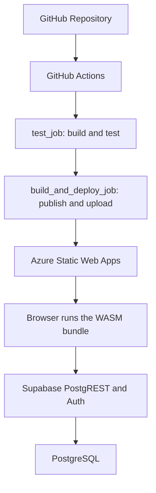

# Deployment Guide

This guide covers how Mes Recettes is deployed. The application is a Blazor
WebAssembly client that compiles to static files; it is hosted on **Azure
Static Web Apps** and talks directly to Supabase from the browser.

## 📋 Table of Contents

- [Deployment Overview](#deployment-overview)
- [Prerequisites](#prerequisites)
- [Azure Static Web Apps](#azure-static-web-apps)
- [CI/CD Pipeline](#cicd-pipeline)
- [Supabase Configuration](#supabase-configuration)

## 🎯 Deployment Overview


```mermaid
graph TD
    Repo[GitHub Repository] --> Actions[GitHub Actions]
    Actions --> Test[test_job: build and test]
    Test --> Deploy[build_and_deploy_job: publish and upload]
    Deploy --> Swa[Azure Static Web Apps]
    Swa --> Browser[Browser runs the WASM bundle]
    Browser --> Supabase[Supabase PostgREST and Auth]
    Supabase --> Postgres[PostgreSQL]
```

Every push to `main` builds, tests and deploys. Pull requests targeting `main`
run the same two jobs; closing a pull request triggers a third job that tears
down its Static Web Apps preview environment.

## 📋 Prerequisites

- .NET 10.0 SDK (the workflow pins `10.0.x`)
- Git
- A Supabase project with the schema from the [README](../README.md) applied
- An Azure Static Web Apps resource, and its deployment token stored as a
  repository secret

## 🌐 Azure Static Web Apps

### SPA routing

Blazor handles routing client-side, so the host must serve `index.html` for
paths that do not map to a file — otherwise a refresh on `/recipes/42` returns
404. That is the job of `src/wwwroot/staticwebapp.config.json`:

```json
{
  "navigationFallback": {
    "rewrite": "/index.html",
    "exclude": [
      "/_framework/*",
      "/css/*",
      "/lib/*",
      "/icons/*",
      "/*.{css,js,json,ico,png,svg,woff,woff2,ttf,eot,map,blat,dat,dll,wasm}"
    ]
  },
  "mimeTypes": {
    ".json": "application/json",
    ".wasm": "application/wasm",
    ".dll": "application/octet-stream",
    ".dat": "application/octet-stream",
    ".blat": "application/octet-stream"
  },
  "globalHeaders": {
    "cache-control": "no-cache, no-store, must-revalidate"
  },
  "routes": [
    { "route": "/_framework/*", "headers": { "cache-control": "public, max-age=31536000, immutable" } },
    { "route": "/css/*", "headers": { "cache-control": "public, max-age=604800" } },
    { "route": "/lib/*", "headers": { "cache-control": "public, max-age=604800" } }
  ]
}
```

Three things matter here:

- **`navigationFallback`** makes deep links work, while `exclude` keeps real
  assets from being rewritten to `index.html`.
- **`mimeTypes`** registers the WebAssembly runtime's file types. Serving
  `.wasm` as anything but `application/wasm` breaks streaming instantiation,
  and `.dat`/`.blat` are the ICU and blazor-asset payloads.
- **`globalHeaders` and `routes`** make the default no-store, then re-enable
  long caching for the content-hashed `/_framework/*` files.

The file lives at `src/wwwroot/staticwebapp.config.json`, so `dotnet publish`
copies it to the root of the published output where Static Web Apps expects it.

## 🔧 CI/CD Pipeline

`.github/workflows/azure-static-web-apps-green-pond-067ed2010.yml` defines three
jobs:

| Job | Runs when | What it does |
|---|---|---|
| `test_job` | push to `main`, or a PR that is not closing | `dotnet restore`, `dotnet build --no-restore`, `dotnet test --no-build` |
| `build_and_deploy_job` | same, and only if `test_job` passed | publishes and uploads to Azure Static Web Apps |
| `close_pull_request_job` | a PR against `main` is closed | removes the preview environment |

The deploy job publishes locally and uploads the result rather than letting
Static Web Apps build it:

```yaml
- name: Publish
  run: dotnet publish src/RecettesIndex.csproj -c Release -o publish

- name: Build And Deploy
  uses: Azure/static-web-apps-deploy@v1
  with:
    azure_static_web_apps_api_token: ${{ secrets.AZURE_STATIC_WEB_APPS_API_TOKEN_GREEN_POND_067ED2010 }}
    repo_token: ${{ secrets.GITHUB_TOKEN }}
    action: "upload"
    app_location: "publish/wwwroot"
    output_location: ""
    skip_app_build: true
```

`skip_app_build: true` is required: the Static Web Apps build engine (Oryx) does
not ship the .NET 10 SDK, so the SDK is set up in the workflow and the already
published `publish/wwwroot` is uploaded as-is.

Because `test_job` is a `needs:` dependency of the deploy job, a failing test
blocks the deployment.

## ⚙️ Supabase Configuration

The client reads its Supabase settings from `src/wwwroot/appsettings.json`,
under a lowercase `supabase` key:

```json
{
  "supabase": {
    "Url": "https://<project-ref>.supabase.co",
    "Key": "<anon key>"
  }
}
```

`src/Program.cs` reads `supabase:Url` and `supabase:Key` and builds the Supabase
client with `AutoRefreshToken = true` and `AutoConnectRealtime = false`.

This file is committed, and it is what the deployed application uses. In Blazor
WebAssembly the whole configuration is downloaded and read by the browser, so
the anon key is public by design and cannot be hidden by a build step — see
[SECURITY.md](SECURITY.md) for why that is safe and what enforces access
control. A key that must stay secret cannot live in this project.

> **Note:** the Publish step also sets `supabase_Key` and `supabase_Url`
> environment variables from repository secrets. Nothing reads them: the
> project file defines no substitution target, and the browser loads
> `appsettings.json` at runtime rather than at publish time. The committed file
> is the effective configuration.

The `SUPABASE_URL` and `SUPABASE_KEY` secrets *are* used by
`.github/workflows/supabase-keep-alive.yml`, which reads one row from `recettes`
every three days to keep the free-tier project from being paused for inactivity.

---

For more information, see:
- [Main Documentation](README.md)
- [Development Guide](DEVELOPMENT.md)
- [Architecture Guide](ARCHITECTURE.md)
- [Security Model](SECURITY.md)
