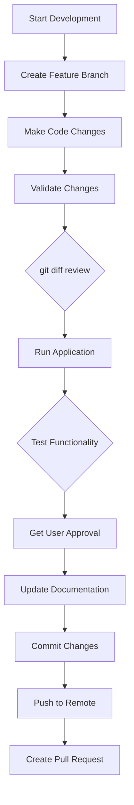

# Development Guide

This guide covers development practices, coding standards, and workflows for the Mes Recettes project.

## 📋 Table of Contents

- [Development Environment](#development-environment)
- [Coding Standards](#coding-standards)
- [Project Patterns](#project-patterns)
- [Development Workflow](#development-workflow)
- [Testing Guidelines](#testing-guidelines)
- [Troubleshooting](#troubleshooting)

## 🛠️ Development Environment

### Required Tools

- **Visual Studio Code** with extensions:
  - C# Dev Kit
  - GitHub Copilot (recommended)
  - GitLens (recommended)
- **.NET 9.0 SDK**
- **Git** for version control
- **GitHub MCP Server** for GitHub operations

### Recommended VS Code Settings

```json
{
  "dotnet.defaultSolution": "RecettesIndex.sln",
  "csharp.format.enable": true,
  "csharp.semanticHighlighting.enabled": true,
  "files.exclude": {
    "**/bin": true,
    "**/obj": true
  }
}
```

## 📝 Coding Standards

### C# Conventions

```csharp
// ✅ Good: Use nullable reference types
public class Recipe
{
    public string Name { get; set; } = string.Empty;
    public string? Notes { get; set; }
}

// ✅ Good: Async/await patterns
public async Task<List<Recipe>> GetRecipesAsync()
{
    try
    {
        var response = await SupabaseClient.From<Recipe>().Get();
        return response.Models ?? new List<Recipe>();
    }
    catch (Exception ex)
    {
        // Handle error appropriately
        return new List<Recipe>();
    }
}

// ✅ Good: Dependency injection
[Inject] private SupabaseClient SupabaseClient { get; set; } = null!;
```

### Blazor Patterns

```csharp
// ✅ Good: Component parameters
[Parameter] public string Title { get; set; } = string.Empty;
[Parameter] public EventCallback<Recipe> OnRecipeSelected { get; set; }

// ✅ Good: Lifecycle methods
protected override async Task OnInitializedAsync()
{
    await LoadDataAsync();
}

// ✅ Good: Error handling in components
private async Task LoadDataAsync()
{
    loading = true;
    try
    {
        recipes = await RecipeService.GetRecipesAsync();
    }
    catch (Exception ex)
    {
        // Show error message to user
        await ShowErrorDialog(ex.Message);
    }
    finally
    {
        loading = false;
    }
}
```

### Database Patterns

```csharp
// ✅ Good: Model definition with Supabase attributes
[Table("recettes")]
public class Recipe : BaseModel
{
    [PrimaryKey("id")]
    public int Id { get; set; }
    
    [Column("name")]
    public string Name { get; set; } = string.Empty;
    
    [Column("notes")]
    public string? Notes { get; set; }
    
    [Column("rating")]
    public int Rating { get; set; }
}

// ✅ Good: Data access with error handling
public async Task<Recipe?> GetRecipeByIdAsync(int id)
{
    try
    {
        var response = await SupabaseClient
            .From<Recipe>()
            .Where(x => x.Id == id)
            .Single();
        return response;
    }
    catch (Exception)
    {
        return null;
    }
}
```

## 🏗️ Project Patterns

### Component Structure

```razor
@page "/recipes"
@using RecettesIndex.Models
@using RecettesIndex.Services
@inject SupabaseClient SupabaseClient
@inject IDialogService DialogService

<PageTitle>Mes Recettes - Recipes</PageTitle>

<MudContainer MaxWidth="MaxWidth.Large">
    <MudText Typo="Typo.h4" Class="mb-4">Recipes</MudText>
    
    @if (loading)
    {
        <MudProgressLinear Indeterminate="true" />
    }
    else if (recipes.Count == 0)
    {
        <MudAlert Severity="Severity.Info">No recipes found.</MudAlert>
    }
    else
    {
        <MudDataGrid Items="recipes" />
    }
</MudContainer>

@code {
    private List<Recipe> recipes = new();
    private bool loading = true;
    
    protected override async Task OnInitializedAsync()
    {
        await LoadRecipesAsync();
    }
    
    private async Task LoadRecipesAsync()
    {
        // Implementation
    }
}
```

### Dialog Implementation

```csharp
public class AddRecipeDialog : ComponentBase
{
    [CascadingParameter] 
    public MudDialogInstance MudDialog { get; set; } = null!;
    
    [Parameter] 
    public Recipe Recipe { get; set; } = new();
    
    private async Task Submit()
    {
        if (IsValid())
        {
            MudDialog.Close(DialogResult.Ok(Recipe));
        }
    }
    
    private void Cancel() => MudDialog.Cancel();
    
    private bool IsValid()
    {
        return !string.IsNullOrWhiteSpace(Recipe.Name);
    }
}
```

### Service Implementation

```csharp
public class RecipeService
{
    private readonly SupabaseClient _supabaseClient;
    private readonly ILogger<RecipeService> _logger;
    
    public RecipeService(SupabaseClient supabaseClient, ILogger<RecipeService> logger)
    {
        _supabaseClient = supabaseClient;
        _logger = logger;
    }
    
    public async Task<List<Recipe>> GetRecipesAsync()
    {
        try
        {
            _logger.LogInformation("Fetching recipes from database");
            var response = await _supabaseClient.From<Recipe>().Get();
            return response.Models ?? new List<Recipe>();
        }
        catch (Exception ex)
        {
            _logger.LogError(ex, "Error fetching recipes");
            throw;
        }
    }
}
```

## 🔄 Development Workflow

### 1. Branch Creation

```bash
# Always create a feature branch
git checkout -b feature/add-recipe-search
git checkout -b fix/rating-validation
git checkout -b refactor/optimize-data-loading
```

### 2. Development Process



### 3. Change Validation Checklist

Before committing any changes:

- [ ] **Code Review**: Use `git diff` to review all changes
- [ ] **Build Check**: Ensure `dotnet build` succeeds
- [ ] **Application Test**: Run `dotnet run` and test functionality
- [ ] **Responsive Test**: Check mobile, tablet, and desktop views
- [ ] **Error Handling**: Verify error scenarios work correctly
- [ ] **Documentation**: Update relevant docs and comments
- [ ] **User Approval**: Get confirmation from stakeholders

### 4. Commit Guidelines

```bash
# Good commit messages
git commit -m "Add recipe search functionality

- Implemented search by name and ingredients
- Added filtering by rating and cookbook
- Included debounced search input for performance
- Updated UI with search results highlighting"

git commit -m "Fix rating validation bug

- Added client-side validation for 1-5 range
- Improved error messages for invalid ratings
- Added unit tests for validation logic"
```

### 5. Pull Request Process

1. **Use GitHub MCP Server** for all GitHub operations
2. **Create comprehensive PR description** with:
   - Summary of changes
   - Testing details
   - Screenshots (if UI changes)
   - Breaking changes (if any)
3. **Request review** from appropriate team members
4. **Address feedback** promptly
5. **Merge using squash** to maintain clean history

## 🧪 Testing Guidelines

### Test Structure

We maintain a comprehensive unit test suite with **318 tests** covering all business logic, validation rules, services, components, and integration scenarios. Tests are organized by functionality:

```
tests/
├── RecipeModelTests.cs                    # Recipe model validation tests
├── AuthorModelTests.cs                    # Author model and FullName property tests
├── BookModelTests.cs                      # Book model functionality tests
├── BookAuthorModelTests.cs                # Junction table relationship tests
├── RecipeValidationTests.cs               # DataAnnotation validation tests
├── RecipeRatingValidationTests.cs         # Rating constraint tests (1-5)
├── ModelRelationshipTests.cs              # Cross-model relationship tests
├── AuthServiceTests.cs                    # Authentication service tests
├── Models/
│   └── AdditionalModelValidationTests.cs  # Comprehensive model validation
├── Services/
│   ├── RecipeServiceTests.cs              # Recipe service layer tests
│   ├── BookAuthorServiceTests.cs          # BookAuthor service tests
│   ├── CacheServiceTests.cs               # Caching functionality tests
│   ├── SupabaseRecipesQueryTests.cs       # Query service tests
│   ├── ResultTests.cs                     # Result<T> pattern tests
│   ├── ServiceConstantsTests.cs           # Service constants tests
│   ├── SupabaseAuthWrapperTests.cs        # Auth wrapper tests
│   └── Exceptions/
│       └── CustomExceptionTests.cs        # Custom exception validation
├── Pages/
│   ├── EditRecipeDialogTests.cs           # Recipe edit component tests
│   ├── EditBookDialogTests.cs             # Book edit component tests
│   └── EditAuthorDialogTests.cs           # Author edit component tests
└── Integration/
    └── ModelIntegrationTests.cs           # Integration scenario tests
```

### Testing Framework

- **xUnit**: Primary testing framework
- **bUnit**: Blazor component testing library
- **NSubstitute**: Mocking library for dependencies
- **Theory Tests**: Data-driven testing with `[InlineData]`
- **Arrange-Act-Assert**: Standard test pattern

### Testing Principles

1. **Comprehensive Coverage**: All business logic must have unit tests
2. **Validation Testing**: Every validation rule must be tested with valid and invalid data
3. **Arrange-Act-Assert Pattern**: All tests follow the AAA pattern
4. **Theory-Driven Tests**: Use `[Theory]` and `[InlineData]` for data-driven test scenarios
5. **Test Before Push**: Run all tests before creating pull requests
6. **Mock Complex Dependencies**: Use NSubstitute for external services and complex dependencies

### NSubstitute Mocking Patterns

```csharp
// ✅ Good: Basic substitution and verification
[Fact]
public async Task SignInAsync_WithValidCredentials_ReturnsTrue()
{
    // Arrange
    var mockAuth = Substitute.For<IGotrueClient<User, Session>>();
    var mockSession = Substitute.For<Session>();
    var mockUser = Substitute.For<User>();
    
    mockSession.User.Returns(mockUser);
    mockAuth.SignIn("test@example.com", "password").Returns(mockSession);
    
    var authService = new AuthService(mockSupabaseClient);

    // Act
    var result = await authService.SignInAsync("test@example.com", "password");

    // Assert
    Assert.True(result);
    await mockAuth.Received(1).SignIn("test@example.com", "password");
}

// ✅ Good: Exception testing
[Fact]
public async Task SignInAsync_ThrowsException_ShouldPropagate()
{
    // Arrange
    var mockAuth = Substitute.For<IGotrueClient<User, Session>>();
    mockAuth.SignIn(Arg.Any<string>(), Arg.Any<string>()).Throws(new Exception("Network error"));

    // Act & Assert
    await Assert.ThrowsAsync<Exception>(() => authService.SignInAsync("test", "test"));
}
```

### Test Examples

```csharp
// ✅ Good: Comprehensive validation testing
[Theory]
[InlineData(1, true)]
[InlineData(3, true)]
[InlineData(5, true)]
[InlineData(0, false)]
[InlineData(6, false)]
[InlineData(-1, false)]
public void Rating_ShouldValidateRange_ForAllValues(int rating, bool isValid)
{
    // Arrange
    var recipe = new Recipe { Rating = rating };
    var context = new ValidationContext(recipe);
    var results = new List<ValidationResult>();

    // Act
    var actualIsValid = Validator.TryValidateObject(recipe, context, results, true);

    // Assert
    Assert.Equal(isValid, actualIsValid);
    if (!isValid)
    {
        Assert.Contains(results, r => r.ErrorMessage!.Contains("Rating must be between 1 and 5"));
    }
}

// ✅ Good: Model relationship testing
[Fact]
public void Author_Books_ShouldBeInitialized()
{
    // Arrange & Act
    var author = new Author();

    // Assert
    Assert.NotNull(author.Books);
    Assert.Empty(author.Books);
}
```

### Running Tests

```bash
# Run all tests
dotnet test

# Run tests with detailed output
dotnet test --verbosity normal

# Run specific test class
dotnet test --filter "ClassName=RecipeModelTests"

# Run tests for specific namespace
dotnet test --filter "FullyQualifiedName~RecettesIndex.Tests"

# Generate code coverage (if configured)
dotnet test --collect:"XPlat Code Coverage"
```

### CI/CD Testing

Our GitHub Actions workflow automatically:
1. Runs all unit tests before deployment
2. Prevents merging if tests fail
3. Ensures code quality through automated validation

```yaml
# Testing job in GitHub Actions
test_job:
  runs-on: ubuntu-latest
  name: Test
  steps:
    - name: Checkout
      uses: actions/checkout@v4
    - name: Setup .NET
      uses: actions/setup-dotnet@v4
      with:
        dotnet-version: '9.x'
    - name: Restore dependencies
      run: dotnet restore
    - name: Build
      run: dotnet build --no-restore
    - name: Run tests
      run: dotnet test --no-build --verbosity normal
```

### Dependencies for Testing Complex Types

When testing services that depend on complex external libraries (like Supabase.Client), consider:
- Creating wrapper interfaces for better testability
- Testing integration points separately from unit tests  
- Using partial mocks or test doubles for complex scenarios
- Some complex types may require constructor parameters that are difficult to mock

### Test Coverage Requirements

- **Model Validation**: Test all DataAnnotation validation rules
- **Business Logic**: Test all service methods and their edge cases
- **Error Scenarios**: Test exception handling and error conditions
- **Relationships**: Test entity relationships and navigation properties
- **Authentication**: Test authentication workflows and security

### Running Tests

```bash
# Run all tests
dotnet test

# Run tests with detailed output
dotnet test --verbosity normal

# Run specific test class
dotnet test --filter "ClassName=RecipeModelTests"

# Run tests for specific namespace
dotnet test --filter "FullyQualifiedName~RecettesIndex.Tests"

# Generate code coverage (if configured)
dotnet test --collect:"XPlat Code Coverage"
```
        _mockSupabaseClient.Setup(x => x.From<Recipe>().Get())
            .ReturnsAsync(new ModelResponse<Recipe> { Models = expectedRecipes });
        
        // Act
        var result = await _recipeService.GetRecipesAsync();
        
        // Assert
        Assert.AreEqual(1, result.Count);
        Assert.AreEqual("Test", result[0].Name);
    }
}
```

### Component Testing with bUnit

```csharp
[TestClass]
public class RecipeCardTests : TestContext
{
    [TestMethod]
    public void RecipeCard_ShouldDisplayName_WhenRecipeProvided()
    {
        // Arrange
        var recipe = new Recipe { Name = "Chocolate Cake", Rating = 5 };
        
        // Act
        var component = RenderComponent<RecipeCard>(parameters => parameters
            .Add(p => p.Recipe, recipe));
        
        // Assert
        Assert.IsTrue(component.Markup.Contains("Chocolate Cake"));
        Assert.IsTrue(component.Markup.Contains("★★★★★"));
    }
}
```

### Integration Testing

```csharp
[TestMethod]
public async Task AddRecipe_ShouldPersistToDatabase()
{
    // Test with actual Supabase test database
    var recipe = new Recipe 
    { 
        Name = "Integration Test Recipe",
        Rating = 4,
        Notes = "Test notes"
    };
    
    var result = await _recipeService.AddRecipeAsync(recipe);
    Assert.IsNotNull(result);
    Assert.IsTrue(result.Id > 0);
    
    // Cleanup
    await _recipeService.DeleteRecipeAsync(result.Id);
}
```

## 🐛 Troubleshooting

### Common Issues

#### Build Errors

```bash
# Clear build cache
dotnet clean
rm -rf bin/ obj/
dotnet restore
dotnet build
```

#### Port Conflicts

```bash
# Use specific port
dotnet run --urls "http://localhost:5030"

# Kill existing processes
taskkill /f /im dotnet.exe  # Windows
pkill -f dotnet             # macOS/Linux
```

#### Supabase Connection Issues

1. **Check configuration**: Verify URL and API key in `appsettings.json`
2. **Network connectivity**: Ensure internet connection
3. **API limits**: Check Supabase dashboard for usage limits
4. **CORS settings**: Verify domain is allowed in Supabase

#### Hot Reload Not Working

```bash
# Restart with clean build
dotnet clean
dotnet run --no-hot-reload
```

### Debugging Tips

1. **Use browser dev tools** for client-side debugging
2. **Check console logs** for JavaScript errors
3. **Use Blazor Server debugging** for complex issues
4. **Enable detailed logging** in `appsettings.Development.json`

```json
{
  "Logging": {
    "LogLevel": {
      "Default": "Information",
      "Microsoft.AspNetCore": "Warning",
      "YourNamespace": "Debug"
    }
  }
}
```

## 📊 Performance Guidelines

### Best Practices

- **Lazy loading**: Use `@page` directive with lazy loading
- **Virtualization**: Use `MudVirtualize` for large data sets
- **Debouncing**: Implement debounced search inputs
- **Caching**: Cache frequently accessed data
- **Minimal API calls**: Batch operations when possible

### Memory Management

```csharp
// ✅ Good: Dispose resources
public void Dispose()
{
    _cancellationTokenSource?.Cancel();
    _cancellationTokenSource?.Dispose();
}

// ✅ Good: Use using statements
using var httpClient = new HttpClient();
var response = await httpClient.GetAsync(url);
```

---

For more information, see:
- [Main Documentation](README.md)
- [API Reference](API.md)
- [Architecture Guide](ARCHITECTURE.md)
