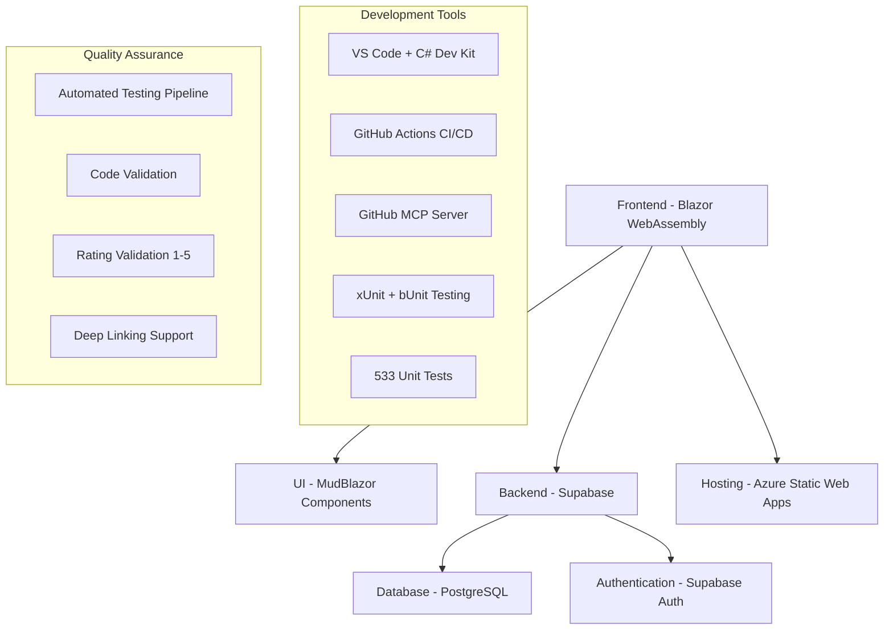
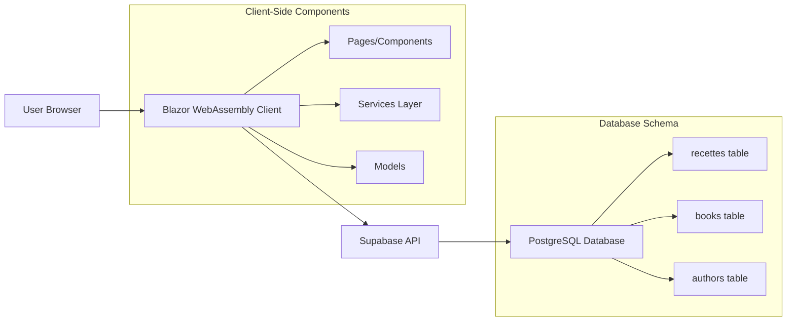
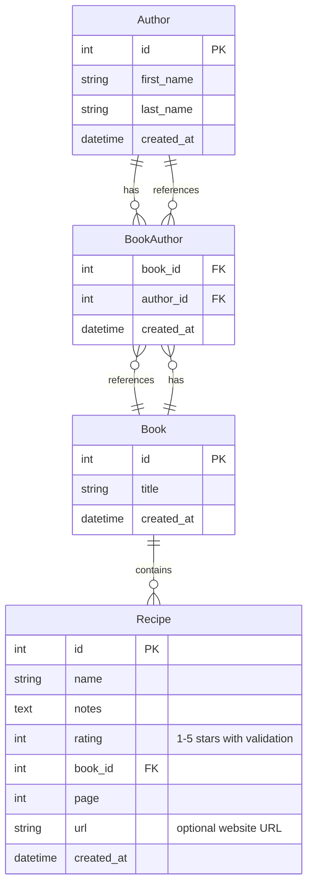

# Mes Recettes - Documentation

Mes Recettes is a personal recipe management application built with Blazor WebAssembly, designed to help home cooks organize their favorite recipes, cookbooks, and authors in a digital format.

## 📋 Table of Contents

- [Project Overview](#project-overview)
- [Architecture](#architecture)
- [Features](#features)
- [Getting Started](#getting-started)
- [Development Guide](#development-guide)
- [API Reference](#api-reference)
- [Deployment](#deployment)
- [Store & Restaurant Features](#store--restaurant-features)
- [Contributing](#contributing)

## 🎯 Project Overview

Mes Recettes is a modern web application that bridges the gap between traditional cookbook collections and digital recipe management. Users can:

- Store and organize their favorite recipes
- Associate recipes with physical or digital cookbooks
- Track recipes from stores, restaurants, and food vendors
- Rate recipes for future reference
- Track page numbers for cookbook references
- Generate print-friendly recipe formats
- Browse recipes by author, book, store, or rating
- View visual badges indicating recipe sources

### Tech Stack



## 🏗️ Architecture

### System Architecture



### Service Layer Reuse

To reduce duplication and standardize error handling and validation, the service layer uses shared helpers:

- `CrudServiceBase<TModel, TService>`: centralizes common CRUD patterns (get by id, create, update, delete) with logging
- `ValidationGuards`: reusable validation helpers for null/empty/positive/range checks
- `CacheServiceExtensions`: utilities for cached list retrieval (`GetOrEmptyAsync`) and multi-key invalidation (`RemoveMany`)

These helpers are used by `AuthorService`, `BookService`, and `StoreService` while preserving domain-specific logic (e.g., author associations for books).

### Project Structure

```
RecettesIndex/
├── 📁 .github/
│   ├── 📁 workflows/          # GitHub Actions CI/CD pipelines
│   │   └── azure-static-web-apps-*.yml # Automated testing & deployment
│   └── 📄 copilot-instructions.md # AI agent development guidelines
├── 📁 src/                    # Main application source
│   ├── 📁 Configuration/      # App configuration files
│   │   └── SupabaseConfig.cs
│   ├── 📁 Layout/             # Application layout components
│   │   ├── MainLayout.razor
│   │   └── NavMenu.razor
│   ├── 📁 Models/             # Data models with validation
│   │   └── Recette.cs         # Recipe, Book, Author, BookAuthor models
│   ├── 📁 Pages/              # Blazor pages and dialogs
│   │   ├── Home.razor
│   │   ├── Recipes.razor
│   │   ├── Books.razor
│   │   ├── Authors.razor
│   │   ├── RecipeDetails.razor
│   │   ├── BookDetails.razor
│   │   ├── AuthorDetails.razor
│   │   ├── PrintRecipe.razor
│   │   └── *Dialog.razor      # Edit dialogs
│   ├── 📁 Services/           # Business logic and data access (query/service pattern + caching)
│   │   ├── 📁 Abstractions/   # Service interfaces
│   │   ├── 📁 Exceptions/     # Custom exceptions
│   │   ├── AuthService.cs
│   │   ├── BookAuthorService.cs
│   │   ├── CacheService.cs
│   │   ├── CacheServiceExtensions.cs
│   │   ├── CrudServiceBase.cs
│   │   ├── ValidationGuards.cs
│   │   ├── RecipeService.cs
│   │   ├── SupabaseRecipesQuery.cs
│   │   ├── SupabaseAuthWrapper.cs
│   │   ├── Result.cs
│   │   └── ServiceConstants.cs
│   ├── 📁 Shared/             # Shared components
│   │   ├── ActionBar.razor
│   │   └── HeroSection.razor
│   ├── 📁 wwwroot/            # Static assets
│   │   ├── index.html
│   │   ├── staticwebapp.config.json # Azure Static Web Apps routing
│   │   ├── css/
│   │   └── icons/
│   ├── 📄 Program.cs          # Application entry point
│   └── 📄 _Imports.razor      # Global using statements
├── 📁 tests/                  # Comprehensive unit test suite (533 tests)
│   ├── � Integration/        # Integration and relationship tests
│   │   └── ModelIntegrationTests.cs
│   ├── 📁 Models/             # Model validation tests
│   │   └── AdditionalModelValidationTests.cs
│   ├── 📁 Pages/              # Component tests (bUnit)
│   │   ├── EditRecipeDialogTests.cs
│   │   ├── EditBookDialogTests.cs
│   │   └── EditAuthorDialogTests.cs
│   ├── 📁 Services/           # Service layer tests
│   │   ├── 📁 Exceptions/     # Exception tests
│   │   │   └── CustomExceptionTests.cs
│   │   ├── CrudServiceBaseTests.cs
│   │   ├── ValidationGuardsTests.cs
│   │   ├── CacheServiceExtensionsTests.cs
│   │   ├── RecipeServiceTests.cs
│   │   ├── BookAuthorServiceTests.cs
│   │   ├── CacheServiceTests.cs
│   │   ├── SupabaseRecipesQueryTests.cs
│   │   ├── SupabaseAuthWrapperTests.cs
│   │   ├── ResultTests.cs
│   │   └── ServiceConstantsTests.cs
│   ├── 📄 AuthorModelTests.cs
│   ├── 📄 BookModelTests.cs
│   ├── 📄 RecipeModelTests.cs
│   ├── 📄 BookAuthorModelTests.cs
│   ├── 📄 RecipeValidationTests.cs
│   ├── 📄 RecipeRatingValidationTests.cs
│   ├── 📄 ModelRelationshipTests.cs
│   └── 📄 RecettesIndex.Tests.csproj    # Test project configuration
├── 📁 docs/                   # Project documentation
│   ├── README.md              # Complete project overview
│   ├── API.md                 # Data models and API reference
│   ├── ARCHITECTURE.md        # System design and decisions
│   ├── DEVELOPMENT.md         # Development guidelines and setup
│   └── DEPLOYMENT.md          # Deployment and hosting guide
├── 📄 RecettesAI.slnx         # Solution file
└── 📄 README.md               # Quick start guide
```

## ✨ Features

### Core Functionality

#### Recipe Management
- **CRUD Operations**: Create, read, update, and delete recipes with comprehensive validation
- **Rich Text Support**: Store ingredients, instructions, and personal notes
- **Rating System**: 1-5 star rating system with enforced validation constraints
- **Data Validation**: Business rules validation with user-friendly error messages
- **Search & Filter**: Find recipes by name, rating, or cookbook

#### Cookbook Integration
- **Book Association**: Link recipes to physical or digital cookbooks
- **Page Tracking**: Store page numbers for easy reference
- **Author Management**: Organize books by authors
- **Collection Overview**: View all recipes from a specific book or author

#### Recipe Sources
- **Multiple Source Types**: Support for books, stores/restaurants, and websites
- **Website Integration**: Store URLs for online recipes with clickable links
- **Source Tracking**: Visual badges indicating recipe origin
- **Flexible Organization**: Recipes can come from any combination of sources

#### User Experience
- **Responsive Design**: Works on desktop, tablet, and mobile devices
- **Print-Friendly**: Generate clean print versions of recipes
- **Material Design**: Modern UI using MudBlazor components
- **Dark/Light Themes**: Automatic theme support

### Data Relationships



## 🚀 Getting Started

### Prerequisites

- [.NET 9.0 SDK](https://dotnet.microsoft.com/download/dotnet/9.0)
- [Visual Studio Code](https://code.visualstudio.com/) with C# Dev Kit extension
# Run tests (comprehensive unit test suite - 533 tests)
- A Supabase account (for backend services)

### Installation

1. **Clone the repository**
   ```bash
   git clone https://github.com/mongeon/RecettesIndex.git
   cd RecettesIndex
   ```

2. **Restore dependencies**
   ```bash
   dotnet restore
   ```

3. **Configure Supabase**
   - Create a new project at [supabase.com](https://supabase.com)
   - Update `wwwroot/appsettings.json` with your Supabase URL and API key
   ```json
   {
     "Supabase": {
       "Url": "YOUR_SUPABASE_URL",
       "Key": "YOUR_SUPABASE_ANON_KEY"
     }
   }
   ```

4. **Run tests** (recommended before development)
   ```bash
   dotnet test
   ```

5. **Run the application**
   ```bash
   dotnet run --project src
   ```

5. **Open in browser**
   Navigate to `http://localhost:5000` (or the URL shown in the terminal)

### Database Setup

The application expects the following database schema in Supabase:

```sql
-- Authors table
CREATE TABLE authors (
    id SERIAL PRIMARY KEY,
    first_name VARCHAR(255) NOT NULL,
    last_name VARCHAR(255),
    created_at TIMESTAMP DEFAULT NOW()
);

-- Books table
CREATE TABLE books (
    id SERIAL PRIMARY KEY,
    title VARCHAR(255) NOT NULL,
    created_at TIMESTAMP DEFAULT NOW()
);

-- Books-Authors junction table (many-to-many)
CREATE TABLE books_authors (
    book_id INTEGER REFERENCES books(id) ON DELETE CASCADE,
    author_id INTEGER REFERENCES authors(id) ON DELETE CASCADE,
    created_at TIMESTAMP DEFAULT NOW(),
    PRIMARY KEY (book_id, author_id)
);

-- Stores table
CREATE TABLE stores (
    id SERIAL PRIMARY KEY,
    name VARCHAR(255) NOT NULL,
    address TEXT,
    phone VARCHAR(50),
    website TEXT,
    notes TEXT,
    created_at TIMESTAMP DEFAULT NOW()
);

-- Recipes table
CREATE TABLE recettes (
    id SERIAL PRIMARY KEY,
    name VARCHAR(255) NOT NULL,
    notes TEXT,
    rating INTEGER CHECK (rating >= 1 AND rating <= 5), -- Enforced validation
    book_id INTEGER REFERENCES books(id),
    page INTEGER,
    store_id INTEGER REFERENCES stores(id),
    url TEXT, -- Optional website URL for online recipes
    created_at TIMESTAMP DEFAULT NOW()
);
```

## 🛠️ Development Guide

For detailed development information, see:
- [Development Guide](DEVELOPMENT.md)
- [API Reference](API.md)
- [Architecture Details](ARCHITECTURE.md)

### Quick Development Commands

```bash
# Clean and rebuild
dotnet clean && dotnet build

# Run with specific port
dotnet run --urls "http://localhost:5030"

# Run tests (comprehensive unit test suite - 533 tests)
dotnet test

# Run tests with detailed output
dotnet test --verbosity normal

# Run specific test file
dotnet test --filter "ClassName=RecipeModelTests"

# Run tests with coverage
dotnet test --collect:"XPlat Code Coverage"

# Publish for deployment
dotnet publish -c Release
```

### Development Workflow

```mermaid
flowchart TD
    A[Create Feature Branch] --> B[Make Changes]
    B --> C[Add Unit Tests]
    C --> D[Run Test Suite]
    D --> E{All Tests Pass?}
    E -->|No| F[Fix Tests/Code]
    F --> D
-- Stores table
    E -->|Yes| G[Validate Changes]
    G --> H{git diff, git show}
    H --> I[Run Application]
    I --> J{Test Functionality}
    J --> K[Get User Approval]
    K --> L[Commit Changes]
    L --> M[Push to Remote]
    M --> N[Create Pull Request]
    N --> O[GitHub Actions CI/CD]
    O --> P{Tests Pass?}
    P -->|No| Q[Fix Issues]
    Q --> L
    P -->|Yes| R[Code Review]
    R --> S[Merge to Main]
    S --> T[Auto-deploy to Azure]
```

## 📚 Documentation Structure

- **README.md** (this file): Complete project overview and getting started guide
- **[DEVELOPMENT.md](DEVELOPMENT.md)**: Detailed development guidelines and best practices
- **[API.md](API.md)**: API reference and data models documentation
- **[ARCHITECTURE.md](ARCHITECTURE.md)**: System architecture and design decisions
- **[DEPLOYMENT.md](DEPLOYMENT.md)**: Deployment and hosting instructions

## 🤝 Contributing

We welcome contributions! Please follow these guidelines:

1. **Read the development docs**: Familiarize yourself with [DEVELOPMENT.md](DEVELOPMENT.md)
2. **Follow the workflow**: Always create feature branches, never work directly on main
3. **Validate changes**: Use git tools and run the application before committing
4. **Update documentation**: Keep all docs current with your changes
5. **Use GitHub MCP server**: For all GitHub operations (PRs, issues, etc.)

### Code Style

- Follow C# naming conventions (PascalCase for public members)
- Use nullable reference types throughout
- Implement async/await patterns for I/O operations
- Use MudBlazor components consistently
- Include proper error handling and loading states

## 📄 License

This project is licensed under the MIT License - see the [LICENSE](LICENSE) file for details.

## 🏪 Store & Restaurant Features

### Overview

The application now supports tracking recipes from stores, restaurants, websites, and prepared meal vendors, complementing the traditional cookbook management.

### Key Features

- **Store Management**: Full CRUD operations for stores and restaurants
- **Store Information**: Track name, address, phone, website, and notes
- **Recipe Association**: Link recipes to specific stores
- **Website Integration**: Store URLs for online recipes with clickable links
- **Visual Source Badges**: Color-coded badges showing recipe origin
  - 📖 Blue for cookbooks
  - 🏪 Orange for stores/restaurants
  - 🌐 Green for websites
  - 🏠 Gray for homemade recipes
- **Store Details Page**: View all recipes from a specific store
- **Website Links**: Direct links to online recipes
- **Dashboard Integration**: Statistics on most popular stores and websites
- **Advanced Filtering**: Filter recipes by store or website
- **Print Support**: Include store and website information in printed recipes

### Documentation

For complete store feature documentation, see [STORE_FEATURES.md](STORE_FEATURES.md).

## 🆘 Support

For questions or issues:
1. Check the [documentation](docs/)
2. Search existing [GitHub issues](https://github.com/mongeon/RecettesIndex/issues)
3. Create a new issue with detailed information

---

**Made with ❤️ for home cooks who love to organize their recipes**
